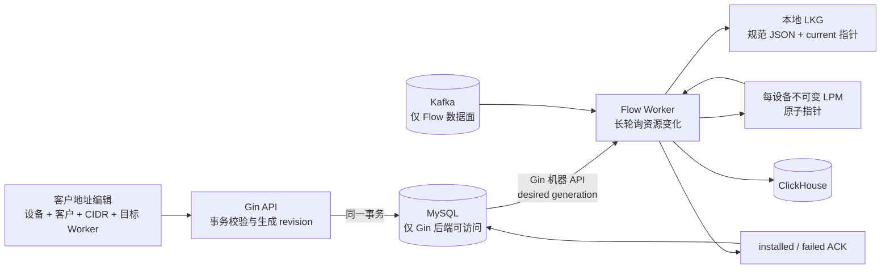

# Flow Worker 控制面收敛修复设计与任务清单

状态：**设计完成，尚未编码**  
日期：2026-09-20  
适用范围：Agent/Collector/Worker 注册、设备分配、客户源地址变更、期望配置发布、状态感知、ACK、热加载与本地 LKG。  
不在本轮范围：sFlow/NetFlow 解码、Kafka 数据通道、ClickHouse 查询、WADS 编码、六分类算法本身、SNMP 轮询算法。

硬架构约束：**只有 Gin 管理后端可以访问 MySQL。Worker、Agent、Flow Collector、SNMP Collector 和 System Agent 均不得持有 MySQL 凭据、建立 MySQL 连接或直接查询管理表。** 这些机器进程只能通过认证后的控制面 API 获取配置、任务与不可变制品，并通过 API 回报状态和 ACK；Flow/SNMP 数据面按职责可以直接写 Kafka/ClickHouse。

> 本文是一次纠偏设计。它覆盖 `flow-address-artifact-deployment-design.md` 中“客户源地址必须组成完整 Worker deployment manifest 才能生效”的部分，但不否定 WADS、规范 JSON、Ed25519 校验、BART/LPM、LKG 和原子切换等已经正确的基础能力。

## 1. 结论

客户源地址的新增、修改和删除，本来只需要完成下面这条闭环：

```text
管理员编辑某设备的客户 CIDR，并选择目标 Worker
  → MySQL 事务保存规范数据和不可变 revision
  → 同事务更新这些 Worker 的 desired generation
  → 在线 Worker 立即长轮询取得变更；离线 Worker 上线后取得变更
  → Worker 校验并在后台编译每设备 LPM
  → 原子落盘 LKG
  → 原子替换内存中该设备的边界指针
  → ACK installed generation
  → 后续 Flow 写入该 boundary revision，状态页显示 desired = installed
```

当前没有闭环，不是因为缺少 trie、签名、文件持久化或 ACK 底层能力，而是因为控制面被拆成并行且互相不负责的多套状态机：

1. 客户 CIDR CRUD 只保存 `draft`，明确不触发发布；
2. 设备到 Worker 的绑定又触发旧版全局 enrichment publication；
3. 新版实现要求 WADS、全局分类策略、每设备边界组成三件套 deployment；
4. Worker 同时运行 v1/v2 dual sync；
5. Agent 注册使用 `agent-control-plane-url`，客户地址发布使用另一条 `control-plane-url`；注册成功不代表发布通道已启用；
6. UI 把上述断裂暴露成三个页面和额外的“校验/发布/等待安装”步骤；
7. 测试把“客户地址保存后不产生绑定、不产生发布”写成了正确行为。

因此，继续补按钮或补一次 API 调用只会继续扩大分裂。修复必须先确定单一所有权，再复用现有可靠部件。

## 2. 这 48 小时为什么没有收敛

### 2.1 问题分解错误

把三种生命周期完全不同的数据当成一个发布单元：

| 数据 | 实际变化频率和范围 | 正确发布方式 | 当前 WIP 做法 |
|---|---|---|---|
| 全局 Geo/ASN/运营商地址库 | 低频、全局、大对象 | 异步构建 WADS，按需分发 | 与客户 CIDR 一起放入 Worker deployment |
| 六分类策略 | 低频、全局、小对象 | 独立策略 revision | 与客户 CIDR 一起放入 Worker deployment |
| 设备客户源 CIDR | 高频、单设备、小对象 | 每设备独立 desired revision | 修改后仍要求重新组合 WADS+策略+边界 |

结果是一次 `/32` 或 `/128` 的客户地址修改，也必须等待全局地址库、分类配置、Worker 选择和组合发布。这个复杂度不是可靠性，而是错误耦合。

### 2.2 先造“通用发布平台”，后补业务闭环

当前 WIP 先增加了 artifact、deployment、deployment_artifacts、四阶段 ACK、operation job、v1/v2 双同步，再试图让客户 CIDR 适配它。正确顺序应当相反：先冻结“一个设备的客户边界如何从编辑变成某 Worker 的 installed revision”，再决定哪些已有基础件可复用。

### 2.3 将持久期望状态误解为一次发布动作

用户点击发布不是可靠性的来源。可靠性的来源应是：MySQL 中一直存在 `desired_generation > installed_generation` 的事实，Worker 无论断线、重启、ACK 丢失还是服务端重启，都能继续收敛。当前 UI 把可靠性寄托在人工完成多步向导，反而更容易漏操作。

### 2.4 测试验证了错误需求

`internal/server/flow_enrichment_publications_integration_test.go` 当前明确断言：

- 客户边界保存后 `automaticBindings == 0`；
- 客户边界保存后 `automaticPublications == 0`；
- 管理员之后必须显式把 WADS、策略和边界组合后再发布。

这使测试通过不代表用户闭环成立，反而证明断裂被固化成了验收标准。

### 2.5 “进程在线”和“业务版本已安装”被混淆

Agent heartbeat 只能回答进程是否在线、运行什么版本；它不能回答某设备的客户边界是否已经安装。反过来，业务配置 ACK 也不能代替进程健康。当前页面和接口在 `registered`、`active`、`desired`、`downloaded`、`installed` 间缺少清晰投影，导致“Worker 已运行但页面说没有 Worker”以及“Agent 已注册但远程 enrichment 没启用”同时出现。

## 3. 当前代码事实审计

> 本节描述 2026-09-20 工作区事实。migration `0049`、v2 deployment handler/UI/loader 仍是未提交 WIP，不能当成生产已完成能力。

### 3.1 客户 CRUD 是断点

`internal/server/flow_customer_boundaries.go` 的 create/update/delete：

- 正确写入客户和 CIDR；
- 正确计算 `source_revision`；
- 返回 `runtime_state: "draft"`、`publication_required: true`；
- **不创建目标 Worker、不写 desired generation、不唤醒 Worker、不等待 ACK**。

所以源地址是否生效依赖管理员记得去另一个页面完成另一个生命周期。这正是当前流量仍落入 transit/unknown 的直接控制面原因之一。

### 3.2 绑定路由仍调用旧发布器

`internal/server/flow_worker_bindings.go` 在变更设备绑定时：

- 增加全局 classification profile 的 row version；
- 调用 `enqueueFlowEnrichmentPublishTx()`；
- 进入旧版 `flow_enrichment_publications` 状态机；
- 没有进入新 `flow_worker_deployments` desired 状态。

同一业务事件由旧链路处理，而新 UI/新 Worker loader 等待新链路，形成典型 split-brain。

### 3.3 Agent 注册和业务配置分成两个控制面 URL

`cmd/watchdog-flow-worker/main.go` 同时定义：

- `-agent-control-plane-url`：注册、计划、ACK、心跳；
- `-control-plane-url`：enrichment publication。

`deploy/systemd/activate-agent.sh` 为 flow worker 只选择前者，并明确避免自动启用后者。因此“Agent 页面能看到 Worker”不等于“Worker 会拉客户地址”。这不是操作错误，而是配置契约本身允许半启用状态。

### 3.4 v1/v2 同时存在

`internal/flowworker/version_dual_sync.go` 和 `cmd/watchdog-flow-worker/main.go` 同时构造：

- legacy `RemoteVersionSync`；
- v2 `RemoteDeploymentSync`；
- `DualRemoteVersionSync` 在首次 v2 之前回退 v1，之后永久切换。

配合旧 publication、新 deployment、旧 binding trigger、新 UI，系统实际上存在两套 desired cursor、两套 ACK 和两套恢复语义。

### 3.5 新 v2 仍强制三件套

`internal/flowworker/deployment_manifest.go` 要求至少包含：

- 一个 `address_catalog`；
- 一个 `classification_policy`；
- 可选的多个 `device_boundary`。

`internal/server/flow_worker_deployments.go` 的发布请求还要求显式 `worker_ids` 和 `device_ids`，并通过 operation job 生成完整 deployment。它解决了签名、授权和原子安装，但没有解决“客户 CIDR 应独立更新”的基本边界。

### 3.6 Worker 选择条件错误

`ensureFlowWorkerDeviceBinding()` 只接受 `kind=flow_worker AND status=active` 的 Worker。离线、刚注册或重启中的 Worker 无法提前分配 desired 配置；管理员只能等它在线后再操作。可靠控制面应允许给已注册但离线的 Worker 写入期望状态，待其上线自动收敛。

### 3.7 前端只是暴露了后端分裂

- `flow-customer-boundaries.tsx` 保存后只提示草稿和需要发布；
- `flow-worker-deployments.tsx` 再要求选设备、选 Worker、校验、发布和轮询 operation job；
- 可选设备只来自 `enabled=true`，可选 Worker 又经过 active/registered 过滤；
- 任一前置条件缺失就显示“无设备/无 Worker”；
- transport、路由或代理错误只显示 `Failed to fetch`，不能区分 404、401、CORS、HTML fallback 和后端断线。

### 3.8 当前可复用成果

以下实现方向正确，不应重写：

- 客户 CIDR 规范化及 IPv4/IPv6 BART LPM；
- WADS 二进制地址库及内存索引；
- Ed25519 canonical envelope 和既有 trust key；
- Worker 影子编译后 atomic pointer swap；
- 临时文件、checksum、fsync、rename 的 LKG 落盘；
- ACK 幂等、installed 里程碑不被迟到失败覆盖；
- Agent credential/mTLS、heartbeat、boot ID、capability；
- systemd/容器负责进程启动和重启的边界。

以下 WIP 不应继续按当前形态扩展：

- 客户 CIDR 修改触发完整三件套 manifest；
- 小型边界更新必须创建 operation job；
- `DualRemoteVersionSync` 长期存在；
- 客户 CRUD 保存草稿后再去独立发布页；
- 只有 active Worker 才能成为期望配置目标；
- Agent URL 和 enrichment URL 表达两个可独立遗漏的控制面；
- 用 Kafka 传控制消息或让 Gin 主动连接 Worker。

### 3.9 前端长期 `Loading...` 是另一项独立回归

当前去 SPA WIP 并不是真正的传统多页实现，而是“每个路由生成一份 HTML，但所有 HTML 仍启动同一个 React 应用”的混合态：

- `frontend/scripts/build-mpa.ts` 为每个路由复制同一个 Vite 文档；
- `frontend/src/components/router.tsx` 把每次导航改成整页 `window.location`；
- 新文档仍从 `frontend/src/main.tsx` 启动完整 React、国际化、主题、Navbar 和 lazy route；
- 每次整页导航都先请求 `install-status`，再请求 `session/current`，然后才加载具体页面 chunk；
- `fetchWatchdogAPI()` 没有统一 timeout/AbortController，任一请求不返回都会让 `PageLoading` 永久存在；
- `flow-worker-deployments.tsx` 首屏 `Promise.all` 等待 Agent、设备、绑定、deployment 四个 API，任一慢请求拖住整块页面；
- 只要存在待安装 deployment，该页面每 2 秒 `refresh()`，每次都把 `loading` 重新设为 `true`；
- operation job 的浏览器轮询最长 120 秒，进一步把控制面状态机暴露成用户长等待。

因此前端长期 loading 不是客户 CIDR、WADS 或 Worker 热加载本身需要的复杂度，而是两项未完成改造叠加后的回归。处理原则：

1. **立即冻结去 SPA/MPA 框架改造**，不得把它作为客户地址闭环的前置条件；
2. 先恢复一个已知可运行的前端启动与导航基线，安装状态和会话检查必须有超时、可重试和明确错误，不能永久 loading；
3. 后续是否完成真正 MPA，必须另立设计和验收，不在 Flow 控制面修复中继续边改边迁；
4. Flow 页面只维护自己的局部状态，不得用一个 `loading` 同时表达初始载入、后台轮询、刷新和发布；
5. 后台状态刷新不得清空已显示数据或重新遮罩整页；请求必须支持取消、超时和 stale response 防护；
6. 客户地址闭环只需要一个页面、一次保存请求和局部 desired/installed 状态更新，不再加载组合 deployment 页面。

## 4. 目标架构：一个身份面、一个期望状态模型、多个资源流



### 4.1 所有权只有四条

1. **systemd/容器运行时**：安装、启动、停止、重启、用户权限、资源限制；Web 后端不远程启动进程。
2. **Agent Registry**：进程身份、credential、kind/capability、软件版本、heartbeat、online/offline/revoked。
3. **Agent Plan**：进程运行参数，例如 Kafka/ClickHouse endpoint、批大小和资源预算；不保存客户业务地址。
4. **Resource Desired State**：按 Worker、设备和资源类型保存 desired/installed generation；客户地址属于这里。

不再为每种资源重新实现注册、鉴权、健康和计划状态机。资源流只复用 Agent 身份，保存自己的 desired/observed 投影。

### 4.2 MySQL 访问边界

MySQL 是管理后端的私有实现，不是分布式 Agent 协议：

- 只有 `watchdog-server`/Gin 进程持有 MySQL DSN 和数据库凭据；
- 所有 Agent、Collector、Worker 的配置文件和 systemd environment 不得出现 MySQL host、user、password 或 DSN；
- Agent/Collector/Worker 不能 import 管理仓储或通过共享 repository 绕过 API；
- 机器进程通过统一 control-plane URL、credential/mTLS 和 kind/capability 获取最小授权的数据；
- Server 在 MySQL 内完成权限、assignment、desired/observed、审计和分页查询，再返回有界 DTO；
- API 不可达时机器进程使用已安装 LKG，不能回退为直查 MySQL；
- Kafka 是 Flow 事件数据通道，ClickHouse 是遥测/事实数据存储；它们不是 MySQL 管理面的旁路替代品。

当前 SNMP collector 直接从 MySQL 读取设备、profile/recipe 和调度状态，违反该约束，必须迁移为控制面机器 API：Server 计算有界 collection plan，SNMP collector 拉取/ACK；discovery 结果和 inventory 元数据通过 API 回写管理面，时序样本仍可按既定协议写 ClickHouse。Flow collector 的 exporter/source plan、Flow worker 的 boundary desired、System agent 的运行计划同样只从 API 获取。

### 4.3 Collector 与 Worker 职责

| 进程 | 处理的数据 | 是否接收客户 CIDR | 注册/健康 | 业务 ACK |
|---|---|---|---|---|
| `flow_collect` | UDP sFlow/NetFlow/IPFIX → Kafka | 否 | Agent Registry/API | exporter/source plan ACK |
| `flow_worker` | Kafka → enrich/classify → ClickHouse | **是** | Agent Registry/API | boundary installed ACK |
| `snmp_collector` | SNMP poll/discovery → ClickHouse | 否 | Agent Registry/API | collection plan/recipe ACK |
| `system_agent` | 主机指标 | 否 | Agent Registry/API | system plan ACK |

客户边界发布不得依赖 flow collector，也不得把 exporter 的 source IP、设备 management IP、sFlow agent address 混成同一种绑定。Exporter identity → canonical device 是数据面映射；device → Worker 是处理任务分配。

上表中的“API”是唯一管理面入口；任何一行都不允许直接查询 MySQL。

## 5. 客户边界的数据和发布协议

### 5.1 MySQL 业务真值保持不变

继续使用现有关系：

```text
devices
  └─ flow_device_customers
       └─ flow_customer_source_prefixes
```

一个设备有多个客户；一个客户有多段 IPv4/IPv6 CIDR。客户地址只表达源地址归属，不复制大型 Geo/ASN/运营商数据。

### 5.2 独立的不可变 revision

新增或收敛为一个小型 revision 表：

`flow_device_boundary_revisions`

| 字段 | 语义 |
|---|---|
| `id` | 不可变 revision ID |
| `device_id` | 目标观测设备 |
| `generation` | 该设备单调递增版本 |
| `source_revision` | 规范业务行的摘要，用于幂等 |
| `schema_version` | wire schema，初始为 1 |
| `payload_json` | 规范 JSON，小对象直接存 MySQL |
| `payload_checksum` | `sha256:` + 规范 bytes |
| `signature` / `signing_key_id` | 复用现有控制面 Ed25519 trust root |
| `created_by` / `created_at` | 审计 |

建议规范 JSON：

```json
{
  "schema_version": 1,
  "device_id": "01K...",
  "generation": 17,
  "source_revision": "sha256:...",
  "customers": [
    {
      "customer_id": "01K...",
      "customer_name": "七牛",
      "prefixes": ["203.0.113.0/24", "2409:8000::/32"]
    }
  ]
}
```

规范规则：CIDR masked；IPv4 `Unmap()`；customer 和 prefix 稳定排序；同设备跨客户重叠拒绝；未知字段拒绝；删除客户或前缀也生成新 revision，不删除历史 revision。

### 5.3 desired 是耐久消息，不增加 Kafka 控制 topic

`flow_worker_device_boundary_desired`

| 主键/字段 | 语义 |
|---|---|
| `(worker_id, device_id)` | 一个 Worker 对一个设备只有一个当前期望 |
| `desired_generation` | 单调，只能前进 |
| `revision_id` | 指向不可变 boundary revision |
| `assigned_at/by` | 谁选择了这个 Worker |
| `revoked` | tombstone/解除分配，不物理丢失事件 |

这行就是可靠消息：断网不会丢、服务端重启不会丢、Worker 上线后仍能读取。事务提交后可发送内存 wake signal 缩短延迟，但 wake 丢失不影响正确性，Worker 仍会轮询 desired。

### 5.4 observed 与心跳分开

`flow_worker_device_boundary_observed`

| 字段 | 语义 |
|---|---|
| `(worker_id, device_id)` | 唯一观测状态 |
| `installed_generation/revision_id` | 已持久化并已切换到内存的版本 |
| `installed_checksum` | 实际安装对象 |
| `installed_at` | 安装时间 |
| `boot_id` / `software_version` | 证据来源 |
| `last_attempt_at` | 最近尝试 |
| `failed_generation` | 失败针对哪个 desired |
| `error_code/stage/message` | 稳定机器错误 + 可读说明 |

状态由数据推导，不再维护多份可漂移字符串：

- 无分配：`unassigned`；
- desired > installed 且 Worker online：`pending/installing`；
- desired = installed：`installed`；
- failed_generation = desired：`failed`；
- desired > installed 且 heartbeat 过期：`worker_offline`。

`downloaded`、`verified` 可作为诊断时间戳，不作为运营主状态。迟到 ACK 不得让 generation 回退。

## 6. 事务和 API 契约

### 6.1 普通编辑同步完成“小计算”，异步完成“跨进程收敛”

普通客户地址保存不需要 operation job。一次 MySQL 事务完成：

1. 锁定设备当前 boundary generation；
2. 校验用户权限、设备、客户、CIDR、IPv4/IPv6、重叠和可配置数量预算；
3. 更新规范业务行；
4. 生成规范 JSON、checksum、签名和不可变 revision；
5. 对 UI 选择的 Worker upsert desired generation；
6. 写审计；
7. commit。

网络下载、编译、落盘和安装天然异步，由 Worker 完成。只有超出可配置阈值的大批量导入才进入 operation job；阈值来自系统设置，不散落硬编码 const。

### 6.2 管理 API

正常 UI 只需要一个保存入口：

```http
PUT /api/v1/flow/devices/{device_id}/customer-boundary
If-Match: "<current-source-revision>"
Content-Type: application/json

{
  "customers": [
    {
      "id": "...",
      "name": "七牛",
      "prefixes": ["203.0.113.0/24", "2409:8000::/32"]
    }
  ],
  "target_worker_ids": ["flow-worker-01"]
}
```

成功返回的是耐久期望，不是假装已经生效：

```json
{
  "device_id": "...",
  "revision_id": "...",
  "generation": 17,
  "source_revision": "sha256:...",
  "targets": [
    {
      "worker_id": "flow-worker-01",
      "health": "online",
      "desired_generation": 17,
      "installed_generation": 16,
      "state": "pending"
    }
  ]
}
```

还需要：

- `GET /api/v1/flow/devices/{device_id}/customer-boundary`：业务数据 + target desired/installed；
- `GET /api/v1/flow/devices/{device_id}/boundary-status`：可分页 Worker 状态；
- `POST /api/v1/flow/devices/{device_id}/boundary-retry`：只重申同一 desired，不生成新 revision；
- `POST /api/v1/flow/devices/{device_id}/boundary-rollback`：生成更高 generation 指向旧业务内容；
- `DELETE` 使用 tombstone revision，Worker ACK 移除后才显示收敛。

### 6.3 Worker 机器 API

复用 Agent credential/mTLS 和 `flow.boundary.v1` capability：

```http
GET /api/v1/agents/{worker_id}/flow-boundaries/desired?after_generation=16&wait_seconds=30
GET /api/v1/agents/{worker_id}/flow-boundaries/{device_id}/revisions/{generation}
POST /api/v1/agents/{worker_id}/flow-boundaries/acks
```

小型 JSON 可直接内联在 desired 响应中；只有超过可配置大小阈值时才使用有界 object endpoint。Worker 只能读取分配给自己的设备。`flow_collect`、`snmp` 或无 capability 的 credential 必须返回 403。

机器 API 必须提供 cursor/ETag、分页和长轮询，避免 Agent 为“找变化”扫描全量管理数据。Server 负责把 MySQL 行投影为有界、版本化 DTO；不得向机器进程暴露 SQL、表名、数据库主键以外的内部存储契约或通用查询入口。

## 7. Worker 热加载和 LKG

Worker 每次取得更高 generation：

1. 校验 Agent 身份、worker ID、schema、签名、checksum、device assignment 和 generation 单调性；
2. 严格解码规范 JSON；
3. 在消费热路径外构建该设备新的不可变 BART/LPM；
4. 写 `revision.json.tmp`，`fsync` 文件，rename 为不可变 revision 文件，再 `fsync` 目录；
5. 原子更新该设备的 `current` manifest；
6. 原子 swap `device_id → *BoundaryIndex` 指针；
7. 发送 installed ACK。

建议本地布局：

```text
/var/lib/watchdog/flow-worker/boundaries/
  <device-id>/
    revisions/<generation>-<checksum>.json
    current.json
```

崩溃语义：

- 编译失败：不落盘、不切换，保留 LKG，ACK failed；
- 磁盘失败：不切换，保留 LKG，ACK failed；
- 落盘后、切换前崩溃：重启从 current/revision 恢复并继续收敛；
- 切换后、ACK 前崩溃：重启加载同一 LKG，幂等补 ACK，不重复下载；
- 收到旧 generation：返回当前 installed，绝不回退；
- tombstone：先持久化 tombstone，再原子移除设备边界，再 ACK；
- 控制面不可达：继续使用 LKG 处理流量，不清空边界。

Worker 启动时必须先恢复所有 `current.json` 并构建内存索引，再开始 Kafka 消费；无法恢复某设备时 fail closed 或隔离该设备，不能静默用空客户边界把流量归为 transit。

## 8. 注册、分配、状态感知的收敛

### 8.1 一个控制面地址

对进程只暴露一个 `WATCHDOG_CONTROL_PLANE_URL` / `-control-plane-url`。注册、heartbeat、Agent plan 和资源 desired 都在同一 API base 下。删除“Agent 已注册但 enrichment URL 未配置”的合法半状态。

生产非 loopback 必须使用 HTTPS，或者 Worker 通过本机可信反向代理访问 loopback；安装器不能生成 `http://公网IP` 又被客户端安全校验拒绝的配置。

### 8.2 注册不等于启动

- systemd/容器负责启动进程；
- Registry 负责证明进程存在；
- UI 可生成 enrollment、查看启动命令和状态，但不获得 root/Docker socket；
- enrollment 成功后 durable credential 落盘，后续重启不重复 enrollment；
- heartbeat 宣告 `kind=flow_worker`、`flow.boundary.v1`、schema ranges、软件版本、boot ID；
- 管理员可以向 registered/offline Worker 分配 desired；只有 revoked 或 capability 不兼容才拒绝。

### 8.3 设备分配

设备到 Worker 的 assignment 是长期配置，不是某次 publication 的临时参数：

- 一个 Worker 可承载多个设备；
- 一个设备可分配多个 Worker，用于并行分区或 HA；
- UI 编辑客户地址时默认勾选现有 assignment，也允许管理员修改目标；
- 修改 assignment 与 boundary desired 在同一事务提交；
- 换 Worker 时先让新 Worker installed，再向旧 Worker发布 tombstone，避免空窗；
- offline Worker 仍显示并可选择，状态为 pending/offline。

### 8.4 状态页必须能回答的五个问题

1. 进程现在是否在线，最后 heartbeat 是何时？
2. 它被分配了哪些设备？
3. 每台设备 desired 与 installed boundary generation 各是多少？
4. 最近一次失败发生在哪个阶段、是否仍在使用 LKG？
5. 新写入 Flow 使用的 `device_boundary_revision` 是什么？

Flow facts/查询 provenance 应保存并展示 boundary revision；否则控制面说已安装也无法证明数据面用了它。

## 9. UI 收敛

### 9.1 正常路径只有一个页面

设备客户地址页提供：

- 设备（来自统一设备清单）；
- 每个客户的多行 CIDR 编辑框；
- 目标 Worker 多选，默认当前 assignment，在线/离线都显示；
- `保存并应用`；
- 每个 Worker 的 `desired / installed / 状态 / 最后错误`。

保存后无需跳到“Flow 分类发布”或“维度发布”页面。全局 WADS 与全局策略仍有自己的管理页，但客户地址修改不触碰它们。

### 9.2 错误信息

禁止只显示 `Failed to fetch`。前端 transport 层必须区分并显示：

- API base 和请求路径；
- HTTP status；
- `request_id`；
- 401/403 权限；
- 404 路由未注册；
- CORS/网络不可达；
- HTML SPA fallback（响应 content-type 不是 JSON）；
- 后端 validation error。

### 9.3 管理员看见真实状态

- `保存成功` 只表示 desired 已提交；
- `已生效` 必须来自对应 Worker installed ACK；
- 离线 Worker 显示“待上线安装”，不能从下拉框消失；
- retry 不制造新版本；
- 同一 generation 的失败和重试历史可展开查看。

## 10. 迁移与旧链删除顺序

不做长期双写。按 Worker capability 单向切换：

1. Server 先支持新 boundary desired/ACK，但旧路径保持只读兼容；
2. Worker 发布 `flow.boundary.v1` capability，先完成 LKG 恢复和 desired 安装；
3. 从当前 MySQL 客户行生成每设备初始 revision，并为 assignment 写 desired；
4. 等新 Worker installed ACK，验证新 Flow 记录带正确 boundary revision；
5. 将该 Worker 标为 boundary-v1 cutover，此后客户编辑只写新 desired；
6. 删除该 Worker 的 composite boundary 读取；WADS 和全局 policy 仍各自独立运行；
7. 所有 Worker 切换后删除 `DualRemoteVersionSync`、旧客户边界打包、旧绑定触发器和旧 UI；
8. 最后前向 migration 删除确认无引用的旧 publication/deployment 字段或表。

可复用 WIP 的处置：

| WIP | 处置 |
|---|---|
| canonical boundary JSON/测试 | 保留并收敛为 per-device schema v1 |
| deployment loader 的 shadow compile/atomic swap | 保留 |
| LKG 文件原子写与 checksum | 保留 |
| ACK 幂等/错误码 | 保留并简化主状态 |
| 三件套 manifest 强制要求 | 删除 |
| boundary 更新 operation job | 删除；只保留超大批量导入 |
| v1/v2 dual sync | capability cutover 后删除 |
| 手工组合发布 UI | 删除 |
| `flow_artifacts` 大对象抽象 | 仅留给 WADS/大对象；小 boundary JSON 不依赖它 |

## 11. 性能、可靠性和准确性门禁

### 11.1 性能

- 普通 1–5,000 CIDR 编辑 API p95 ≤ 300 ms（不等待 Worker）；
- 在线 Worker 从 commit 到 installed ACK p95 ≤ 10 s；
- 单设备 boundary 编译不暂停 Kafka consumer；
- 热路径 lookup 0 allocation，性能不低于现有 BART 基线；
- boundary-only 更新传输中不得包含 WADS bytes；
- 一个设备更新不得重编其他设备的 trie；
- 资源上限由配置和管理页展示，不散落 magic const。

### 11.2 可靠性

- desired 是数据库耐久状态，不依赖瞬时通知；
- Worker 离线 24 小时后上线仍自动安装最新版本；
- ACK 丢失、重复、乱序和服务端重启均幂等收敛；
- 磁盘满、坏签名、坏 checksum、坏 schema、编译超预算时继续使用 LKG；
- Worker restart 在无控制面时仍从文件恢复；
- 解除绑定使用 tombstone，不能只删 DB 行；
- 换 Worker 无分类空窗。

### 11.3 准确性

- IPv4 和 IPv6 客户 CIDR 都命中正确 customer；
- IPv4-mapped IPv6 输入先 `Unmap()`；
- 跨客户重叠拒绝并返回冲突双方；
- 客户地址变更后，WADS checksum/version 保持不变；
- installed 后的合成 Flow 必须写入新 boundary revision；
- 旧 revision 的历史 Flow 不被当前客户名称/地址静默重写；
- transit/unknown 变化可按 boundary revision 对比；
- SNMP 对账单独检查采样覆盖和倍率，不能把所有 Flow/SNMP 差异都归因于客户地址，但客户地址导致的分类遗漏必须消失。

## 12. 可标记任务清单

### FCP-00 事实冻结与旧链止损

- [x] **设计审计**：确认客户 CRUD 只生成 draft，不产生 desired/ACK。
- [x] **设计审计**：确认绑定仍触发旧 `flow_enrichment_publications`，v2 deployment 是并行 WIP。（2026-09-28 复核：已被后续实现取代（以代码为准） — 结论仍成立；“WIP”措辞已过时：v2 已提交（c00e6c646/1270eb196/552d9752b），激活时 v1 与 v2 同时写；`internal/server/flow_worker_bindings.go:111-126`; `internal/server/handlers_address_dimension.go:225,246`）
- [x] **设计审计**：确认 Flow Worker 存在两个 control-plane URL 和 v1/v2 dual sync。
- [x] **设计审计**：确认现有集成测试把“不自动发布”固化为预期。
- [ ] **变更冻结**：在实现开始前禁止继续扩展 composite deployment 和手工发布 UI。
- [x] **前端审计**：确认当前“每路由 HTML + 单 React 启动壳”会在每次导航重复 install/session/lazy route 启动，并且 API 无统一超时/取消。（2026-09-28 复核：已被后续实现取代（以代码为准） — 部分过时：install-status 已按 tab 缓存（main.tsx:263-294），session 有 2.5s×3 超时；业务 API 仍无统一超时；`frontend/scripts/build-mpa.ts:25-47`; `frontend/src/components/router.tsx:63-70`）
- [x] **前端审计**：确认 Flow deployment 页首屏等待四 API、pending 时每 2 秒重置 loading、浏览器等待 operation job 最长 120 秒。（2026-09-28 复核：已被后续实现取代（以代码为准） — 部分过时：已提交代码（自 552d9752b）从无 2s 重置 loading 的轮询；四 API Promise.all 与 120×1s 作业等待仍在；`frontend/src/components/routes/flow-worker-deployments.tsx:94-107,436-444`）
- [x] **前端止损**：冻结当前去 SPA/MPA 框架级改造；不再让 Flow 修复依赖路由、构建或 Nginx 架构变更。（2026-09-28 复核：作废 — 已被 KISS-01C1 的静态 MPA 决策取代（build-mpa 与 nginx 路由已提交）；其部署验收仍待办，prod 未上线；`8e7ec860e`, `ea0cb8c3b`）
- [x] **前端基线决策**：以最后一个真实部署验证可用的导航/启动版本为基线；真正 MPA 另立设计，不用混合态继续试错。（2026-09-28 复核：作废 — 同被 KISS-01C1 取代：团队选择继续做混合 MPA（每页仍启动完整 React），未回退到已验证基线；`8e7ec860e`; `frontend/src/main.tsx:256-419`）
- [ ] **清单校准**：把现有文档中仅有 WIP、未提交或未经过真实进程验收的 `[x]` 改回待办。（2026-09-28 复核：部分完成 — G3 已改回待办；剩余：artifact 设计文档 Phase A–C 仍为 [x] 但 prod 未启用，H1–H3 仍写“未提交”实际已提交；`8e7ec860e`; `docs/flow-module-tasklist.md:287-289,295`）
- [ ] **已提交门禁**：独立提交只包含设计/清单校准，不夹带生产代码。（2026-09-28 复核：部分完成 — 设计已单独纯文档提交；清单校准混进 8e7ec860e（99 个文件，含生产代码）且未做完；`38630d22f`, `ada804230`, `8e7ec860e`）

### FCP-01 单一领域模型与协议冻结

- [ ] **详细设计**：冻结 boundary canonical JSON v1、排序/重叠/IPv4 Unmap/tombstone 规则。（2026-09-28 复核：部分完成 — 排序/重叠/Unmap/空边界 tombstone 已按 composite schema 实现并有测试；剩按 §5.2 改用 generation/source_revision、去 prefix id 并成文冻结；`internal/flowdimension/deployment_artifacts.go:170-175,193-275,298-305`; `internal/flowdimension/deployment_artifacts_test.go:9-88`）
- [ ] **详细设计**：冻结 Agent identity、assignment、desired、observed、heartbeat 的所有权边界。（2026-09-28 复核：部分完成 — 身份（全局共享 token + agent 行）与心跳（只表示存活）已成文；assignment/desired/observed 所有权未定义；`05fe23276`; `docs/watchdog-kiss-architecture.md:195-211`）
- [ ] **详细设计**：冻结 generation 单调、幂等、乱序 ACK、rollback 和换 Worker 两阶段语义。（2026-09-28 复核：部分完成 — composite 已有 per-worker generation 单调、ACK 里程碑不倒退；rollback 与换 Worker 两阶段语义未定义；`internal/server/flow_worker_deployments.go:626-639,857-868`）
- [ ] **详细设计**：冻结普通同步编辑和超大批量 operation job 的可配置分界。
- [ ] **API 契约**：冻结管理 API、Worker long-poll API、ACK DTO、错误码和 content-type。
- [x] **安全契约**：复用一个 trust root；冻结 credential/mTLS、capability 和设备授权。（2026-09-28 复核：作废 — credential/mTLS 已被全局共享 token 取代（服务端无 mTLS），trust root 已统一；capability/设备授权须按共享 token 重新定义；worker 仍留无效 mTLS flag（main.go:99-102）；`aa870f65d`; `internal/server/agents.go:526-547`）
- [ ] **评审门禁**：Reviewer 能仅凭协议回答断网、重启、ACK 丢失、磁盘满、删除和换 Worker 的结果。
- [ ] **已提交门禁**：协议与测试向量独立提交，尚不建表、不接 UI。

### FCP-02 MySQL revision、assignment、desired/observed

- [ ] **迁移**：新增/收敛 `flow_device_boundary_revisions`。
- [ ] **迁移**：新增/收敛 Worker-device assignment 和 boundary desired/observed；不复制 Agent liveness。（2026-09-28 复核：部分完成 — assignment 表已有，但 PK=device_id（一台设备只能一个 worker，不符合 §8.3）；boundary desired/observed 表不存在；`deploy/schema/mysql/0048_flow_worker_targeted_publications.sql:1,5-13`）
- [ ] **约束**：唯一键、FK、generation/checksum/schema CHECK、tombstone 和必要查询索引完整。
- [ ] **编码**：客户 create/update/delete 与 revision/desired/audit 同一事务；失败全回滚。
- [ ] **编码**：允许向 registered/offline 但 capability 兼容的 Worker 分配 desired。（2026-09-28 复核：部分完成 — v2 目标接受 active/registered（含离线）；但绑定仍只接受 active，UI 过滤 registered，也不校验 capability；`internal/server/flow_worker_deployments.go:183-191`; `internal/server/flow_worker_bindings.go:173,193`）
- [ ] **编码**：重复相同 source revision 幂等，不无意义增加 generation。
- [ ] **单元测试**：CIDR、双栈、重叠、If-Match、幂等、删除、rollback、并发编辑。（2026-09-28 复核：部分完成 — CIDR/双栈规范化、跨客户重叠、tombstone（artifact 级）已测；缺 If-Match、幂等、rollback、并发编辑；`internal/server/flow_customer_boundaries_test.go:5-40`; `internal/flowdimension/deployment_artifacts_test.go:42-88`）
- [ ] **集成测试**：真实 MySQL crash/retry、锁竞争、离线 Worker、assignment 变更和 tombstone。
- [ ] **变更测试**：从当前客户行生成初始 revision，证明 WADS 与 policy 未变化。
- [ ] **已提交门禁**：clean install 和 migration replay 通过；不创建第三套 Agent/operation 状态机。

### FCP-03 Agent/Collector/Worker 注册收敛

- [ ] **配置设计**：统一为一个 control-plane base URL；明确 HTTPS/loopback 规则。（2026-09-28 复核：部分完成 — 只配 -control-plane-url 时 agent 通道可兜底共用；但两个 flag 仍并存，激活脚本只写 agent URL，loopback 规则仅 enrichment 客户端有；`cmd/watchdog-flow-worker/main.go:90-91,439-444`）
- [ ] **编码**：Flow Worker 注册成功后同一 client 同时用于 heartbeat、plan、boundary desired/ACK。（2026-09-28 复核：部分完成 — 两条通道已共用同一个共享 token 文件，但仍是两个 HTTP client、两个 URL；无 boundary desired/ACK 通道；`cmd/watchdog-flow-worker/main.go:445-451,707-713`）
- [ ] **编码**：heartbeat 上报 kind、capability、schema range、boot/software version 和 boundary summary。（2026-09-28 复核：部分完成 — 心跳只带 software/api version、capabilities、sent_at；boot_id 仅在 plan ACK；无 schema range、boundary summary、flow.boundary.v1；`internal/agentplan/runtime.go:49-54`）
- [ ] **编码**：Registry health 与 boundary convergence 分开查询和展示。（2026-09-28 复核：部分完成 — 注册表健康与 composite deployment ACK 已分开；无 per-device boundary 收敛的查询与展示；`95bca83d9`; `internal/server/flow_worker_deployments.go:912-975`）
- [ ] **编码**：flow collector 只取得 exporter/source plan，不取得客户 boundary。（2026-09-28 复核：部分完成 — collector 不拉 boundary；但 source plan 仍是本地签名文件（不经 API/ACK），共享 token 下服务端无法按身份拦截；`cmd/watchdog-flow-collect/main.go:44-45,65-70`）
- [ ] **编码**：SNMP collector 改为从机器 API 拉取有界 collection plan/recipe，删除直接 MySQL 设备/recipe 调度查询。
- [ ] **编码**：SNMP discovery/inventory 管理数据通过机器 API 回写；时序样本继续写 ClickHouse，不经 MySQL。
- [ ] **编码**：System agent 和其他 Agent 不持有 MySQL DSN，不得用数据库作为控制面故障回退。（2026-09-28 复核：部分完成 — system/flow 进程已无 MySQL 依赖；SNMP collector 仍持有 DSN（runtime.env + watchdog.yaml）；deploy/systemd/watchdog-snmp-collector.service:11,13）
- [ ] **API/UI**：Agent 页面显示进程、assignment、desired/installed drift 和最近错误，不声称能远程启动进程。（2026-09-28 复核：部分完成 — 已显示 health、plan ACK/desired、last_error、每次运行工作量；缺设备 assignment 与 boundary drift；`e14b16200`; `frontend/src/components/routes/agents.tsx:104-125`）
- [ ] **单元测试**：错误 kind、缺 capability、revoked credential、clock skew、boot ID 变化。（2026-09-28 复核：部分完成 — 错 kind、clock skew、吊销已测；缺 capability 缺失与 boot ID 变化；“revoked credential”现对应吊销 agent 行；`internal/agentplan/contract_test.go:64-66`; `internal/server/device_agent_integration_test.go:206,291`）
- [ ] **实进程集成**：真实 `flow_collect` 与 `flow_worker` 分别注册；只有 worker 能拉 boundary。（2026-09-28 复核：部分完成 — 真实二进制的共享 token 注册/LKG/吊销已测（需 MySQL env）；“只有 worker 能拉”在共享 token 下只能按 URL id 过滤，此半条需改写；`aa870f65d`; `internal/server/agent_process_integration_test.go:80-81,124-134`）
- [ ] **实进程集成**：真实 SNMP collector 在无 MySQL 网络权限、无 MySQL 配置的环境中完成 plan 拉取、轮询、discovery 回报和 ClickHouse 写入。
- [x] **变更测试**：现有 enrollment credential 可升级，不要求重新录入 secret。（2026-09-28 复核：作废 — 已被全局共享 token 取代；升级时必须把各 agent token 文件换成共享 token，否则注册 401、进程被 systemd 循环重启；`aa870f65d`; `deploy/schema/mysql/0050_drop_agent_enrollment_credentials.sql`）
- [ ] **静态门禁**：Agent/Collector/Worker 命令及运行包不得 import MySQL driver/管理 repository；部署模板中不得出现 MySQL 配置。（2026-09-28 复核：部分完成 — worker/collect/system-agent 已干净；snmp-collector 仍引入 go-sql-driver/mysql 与 internal/server；无自动化门禁；`internal/server/snmp_collector_runtime.go:42`）
- [ ] **网络门禁**：集成环境显式阻断机器进程到 MySQL 3306，四类进程仍完成各自闭环。
- [ ] **已提交门禁**：仓库不再出现两个语义重叠的 Flow Worker control-plane URL；机器进程无 MySQL 凭据和直连路径。

### FCP-04 Worker 每设备热加载、文件 LKG 与 ACK

- [ ] **编码**：实现 per-device desired long poll 和授权下载。
- [ ] **编码**：复用现有 canonical 校验、BART 编译、atomic swap 和 checksum。（2026-09-28 复核：部分完成 — 组件在 composite loader 中均已具备，尚未接到 per-device 安装路径；`internal/flowworker/deployment_loader.go:127-157`; `internal/flowdimension/deployment_artifacts.go:145-191`）
- [ ] **编码**：实现 revision 文件、current manifest、file+directory fsync 和 atomic rename。（2026-09-28 复核：部分完成 — tmp+fsync+rename+目录 fsync 原语已有（composite 用）；未实现 boundaries/<device>/revisions + current.json 布局；`internal/flowworker/version_lkg.go:495-609`）
- [ ] **编码**：启动先恢复所有 LKG，再开始 Kafka 消费。（2026-09-28 复核：部分完成 — composite LKG 与 raw-delete barrier 已在 Kafka 消费前恢复；per-device LKG 与单设备隔离不存在；`cmd/watchdog-flow-worker/main.go:209,229,268,346,640-651`）
- [ ] **编码**：安装/失败 ACK 单调幂等；ACK 重试不重复下载或编译。（2026-09-28 复核：部分完成 — composite 已实现（同代已装只补 ACK，对象按 checksum 缓存）；per-device 未实现；`internal/flowworker/deployment_loader.go:85-93`; `internal/server/flow_worker_deployments.go:857-868`）
- [ ] **编码**：tombstone 原子移除、rollback 高 generation、同设备更新不影响其他设备。
- [ ] **单元测试**：IPv4/IPv6、坏签名/checksum/schema、旧 generation、重复 ACK、编译失败。（2026-09-28 复核：部分完成 — composite 已测 v4/v6、篡改、坏 checksum、编译失败；缺旧 generation 拒绝与 per-device 测试；`internal/flowdimension/deployment_artifacts_test.go:9-88`; `internal/flowworker/deployment_loader_test.go:102-141`）
- [ ] **故障测试**：下载中断、磁盘满、fsync/rename 失败、切换前后 crash、ACK 丢失、控制面离线。（2026-09-28 复核：部分完成 — 下载中断、持久化失败、ACK 重试、离线冷恢复已测（多为 v1）；缺磁盘满、fsync/rename 注入、进程级 crash；`internal/flowworker/version_http_test.go:21,154`; `internal/flowworker/version_lkg_test.go:155,250`）
- [ ] **性能测试**：lookup 0 alloc；不同规模 CIDR 的编译、内存、p95/p99；Kafka 消费无暂停峰值。（2026-09-28 复核：部分完成 — 热路径 0 alloc 已测；缺 per-device 不同 CIDR 规模的编译/内存 p95/p99 与 Kafka 暂停测量；`internal/flowworker/enrich_test.go:354-371`; `internal/flowdimension/address_scale_bench_test.go:77-123`）
- [ ] **已提交门禁**：一个真实 Worker 安装后重启断网恢复，desired=installed，Flow facts 带 revision。

### FCP-05 管理 API 与单页 UI 闭环

- [ ] **API**：保存客户/多行 CIDR/target workers 一次完成业务行、revision、assignment 和 desired。
- [ ] **API**：提供状态、retry、rollback、tombstone；所有列表 server pagination/search/sort/filter。
- [ ] **UI**：客户地址页内选择设备、多个客户、多段 CIDR和一个或多个 Worker。（2026-09-28 复核：部分完成 — 设备、多客户、多行 CIDR 已有；Worker 选择已删，且前端契约测试禁止加回；`frontend/src/components/routes/flow-customer-boundaries.tsx:160-195`; `frontend/src/lib/flow-deployment-contract.test.ts:20`）
- [ ] **UI**：offline Worker 可见且可选；默认当前 assignment。（2026-09-28 复核：部分完成 — 组合向导里离线（status=active）worker 可见可选、默认按绑定选中；registered 被过滤；客户页无 worker；`frontend/src/components/routes/flow-worker-deployments.tsx:108,124-128,245-256`）
- [ ] **UI**：显示 desired/installed/health/LKG/error，不再跳转到组合发布页。（2026-09-28 复核：部分完成 — 按 composite deployment 显示 desired/health/ACK/installed/error；无 per-device 与 LKG，仍依赖组合发布区；`frontend/src/components/routes/flow-worker-deployments.tsx:318-370`）
- [ ] **UI**：统一 transport 错误，识别 HTML fallback、CORS、404、401/403、request ID。（2026-09-28 复核：部分完成 — 已识别 HTML fallback、网络错误/超时、非 JSON、status+code；缺 request_id 与路径展示、CORS 与断网区分、404 路由提示；`8e7ec860e`; `frontend/src/lib/api.ts:237-252,288-327`）
- [ ] **UI 稳定性**：install/session/API 请求统一配置可审计超时和 AbortController；路由离开取消请求，超时显示可操作错误而非永久 loading。（2026-09-28 复核：部分完成 — session 有可配超时与重试，PageLoading 10s 后出重试按钮；install-status 与业务 API 仍无超时；`frontend/src/lib/api.ts:101-118,144-146,194`; `frontend/src/components/page-loading.tsx:7-28`）
- [ ] **UI 稳定性**：初始 loading、手动刷新、后台状态轮询和发布动作使用独立状态；后台轮询不遮罩页面、不清空已加载数据。（2026-09-28 复核：部分完成 — 发布用独立 working 状态，刷新不遮罩不清空；初始加载与手动刷新共用 loading；无后台状态轮询；`frontend/src/components/routes/flow-worker-deployments.tsx:84-91,226,343`）
- [ ] **UI 稳定性**：删除客户地址页对四接口 `Promise.all`、2 秒整页 loading 轮询和 120 秒浏览器阻塞等待 operation job 的依赖。（2026-09-28 复核：部分完成 — 2s 轮询已不存在；四 API Promise.all 与 120×1s 作业等待仍与客户地址同页；`frontend/src/components/routes/flow-worker-deployments.tsx:94-107,436-444`）
- [ ] **单元测试**：表单规范化、无 Worker、离线 Worker、冲突 CIDR、并发 ETag。
- [ ] **前后端契约测试**：每条前端 API 路径在 Gin router 注册，响应 JSON content-type。（2026-09-28 复核：部分完成 — 只有手工维护的 Flow 路由清单；非从前端路径推导，无 content-type 断言；`internal/server/router_test.go:78-120`）
- [ ] **前端回归测试**：install-status、session、任一业务 API 分别模拟 pending/timeout/401/404/HTML/CORS；每种情况在规定时间内退出 loading 并给出恢复入口。（2026-09-28 复核：部分完成 — helper 层超时/HTML/取消/重试已测；无针对 install/session/业务 API 的 401/404/CORS/pending 场景测试；`frontend/src/lib/api-transport.test.ts:25-72`）
- [ ] **浏览器集成**：编辑 IPv4+IPv6 → pending → installed，刷新/直达路由不空白、不丢状态。
- [ ] **已提交门禁**：截图中的三步向导不再是客户地址生效的必要路径。

### FCP-06 Capability cutover 与旧链拆除

- [ ] **变更设计**：按 Worker capability 单向切换，不对同一 Worker 双写客户 boundary。
- [ ] **迁移工具**：从当前业务行生成初始 revision/desired，支持 dry-run 和重复执行。
- [ ] **验收**：新 Worker installed、LKG、Flow fact revision 和分类结果全部可证后才 cutover。
- [ ] **编码删除**：移除客户 CRUD 的 draft-only 契约和错误集成测试预期。
- [ ] **编码删除**：移除 binding 对旧全局 publication 的隐式触发。
- [ ] **编码删除**：移除 composite manifest 对 boundary 更新的强制要求。
- [ ] **编码删除**：移除 `DualRemoteVersionSync` 和旧客户边界读取。
- [ ] **UI 删除**：删除仅为客户 CIDR 服务的手工组合发布步骤；全局 WADS/策略页保留。
- [ ] **迁移删除**：代码引用归零后以前向 migration 清理旧表/字段；不得改历史 migration。
- [ ] **回滚演练**：新协议故障时 Worker 使用 LKG；回滚生成更高 generation，不恢复双写。
- [ ] **已提交门禁**：`rg` 证明旧 handler/table/runtime/UI 无生产引用；clean install 只创建目标 schema。

### FCP-07 准确性、SNMP 对账与产品回归

- [ ] **测试数据**：为真实设备创建多个客户，包含 IPv4、IPv6、删除、修改和重叠拒绝向量。
- [ ] **数据面验证**：发布前命中 transit/unknown，installed 后新 Flow 命中正确 customer/六分类。
- [ ] **版本验证**：查询能按 `device_boundary_revision` 解释发布前后结果，不用当前配置重写历史。
- [ ] **SNMP 对账**：同设备、端口、方向和时间桶比较 SNMP/sFlow counter/估算 Flow；分别报告采样覆盖、倍率、丢样和分类遗漏。（2026-09-28 复核：部分完成 — 对账查询（含覆盖率、未知采样、reset/gap）已实现并有测试；无生产调用方与报表，无倍率/丢样/分类遗漏分项；`c00e6c646`, `c539d770e`; `internal/flowch/interface_reconciliation.go:44-65,94`）
- [ ] **负向验证**：客户地址修复不得被用于掩盖 sampling rate、方向未采样或 exporter mapping 错误。
- [ ] **重启回归**：Server、Worker、Kafka、MySQL 任意单点重启后最终收敛且不清空边界。
- [ ] **权限回归**：只有管理员/授权角色能改地址或 assignment；Worker 只能读自己的 desired。
- [ ] **全库门禁**：Go test/vet/race/build、前端 test/typecheck/build、真实 MySQL/Kafka/ClickHouse、浏览器 E2E。
- [ ] **性能门禁**：在线更新 ≤ 10 s、热路径无回退、批量规模和资源预算达到设计基线。
- [ ] **已提交门禁**：独立 reviewer 可从审计、ACK、Flow provenance 和 SNMP 对账复算结论。

## 13. 完成定义

只有同时满足以下条件，才能说“客户源地址发布闭环完成”：

1. 从同一个客户地址页面编辑 CIDR 并选择 Worker，不进入第二个发布向导；
2. API commit 后马上产生不可变 boundary revision 和 Worker desired generation；
3. Worker 离线时不丢，在线后自动拉取；
4. Worker 先持久化文件，再原子热加载内存，再 ACK installed；
5. 页面显示每个 Worker 的 desired/installed，而不是只显示 Agent online；
6. Worker 重启且控制面离线时能用 LKG 正常分类；
7. 新 Flow 事实携带 boundary revision，IPv4/IPv6 均命中正确客户；
8. 修改客户地址不改变 WADS 或全局 policy 的版本/checksum；
9. 旧 v1、dual sync、手工 composite 客户发布和 draft-only 测试已删除；
10. 真实设备的新时间桶中，因客户边界缺失造成的 transit/unknown 消失；剩余 Flow/SNMP 偏差按采样覆盖、倍率或丢样单独解释。

## 14. 明确不做

- 不用 Kafka 传客户配置控制消息；Kafka 只承载 Flow 数据。
- 不让 Gin 连接远端 Worker 或直接执行 `systemctl`。
- 不因一个客户 CIDR 变化重新构建或传输 WADS。
- 不把客户源 CIDR 塞进 Agent plan。
- 不新增另一套 Agent/Worker registry。
- 不允许 Worker、Agent 或 Collector 直接查询 MySQL，也不把 MySQL 凭据下发到机器进程。
- 不为小型 JSON 强制经过对象存储和 operation job。
- 不把 online 当 installed，也不把 ACK 当 heartbeat。
- 不用长期双写掩盖迁移未完成。
- 不在本设计阶段修改生产代码。
- 不在 Flow 客户地址闭环中继续实施去 SPA/MPA、Vite、Nginx 或全局路由框架改造。

## 15. 2026-09-20 生产事故复盘与评审补充

本节记录一次真实发布(把带城市的新地址库 v2 推给生产 Worker)如何逐环失败,作为 §2/§3 诊断的实测印证,并据此补充三点优化。所有现象均在生产 `.18` 上核实。

### 15.1 事故链(印证 split-brain 与三件套耦合)

1. **激活即发布 ≠ 收敛(印证 §2.3 / §3.2)**:UI 激活 v2 地址快照 → 走 `flow.enrichment.publish` 写【旧】`flow_enrichment_publications` ✓;但 Worker 消费的是【新】`flow_worker_deployments`,而激活**没有**生成新 deployment(gen7)。Worker 的 desired 停在 gen6(v1 时代,13:32 创建),故一直以 `dimension_version=1` 分类,`on_net_local_city`(本网本市)恒为 0。同一业务动作只喂了旧状态机,Worker 读新状态机。
2. **手动补 gen7 在 compile 阶段被拒(印证 §3.5)**:`POST /api/v1/flow/deployments` 报 `DEPLOYMENT_COMPILE_FAILED: a new dimension snapshot must become effective with its classification`([internal/flowworker/version_catalog.go:142](../internal/flowworker/version_catalog.go))。
3. **新回归:激活使用过去的 effective_from,导致 pair 的 dimension/classification effective_from 分叉**。实测 v2 publication:`dimension_effective_from=13:36`(快照自身激活时间,激活时已成过去)vs classification `effective_from=13:54`(publish 校验要求未来分钟被顶到当前)。因 v2 是**新** dimension,Worker 要求两者相等(否则会静默延长上一代),遂拒绝。根因是 `activateAddressDimension` 用 `snapshot.EffectiveFrom`(发布时固定、可能已过去)去 enqueue enrichment,而 enrichment publish 又把过去时间顶到未来,两端不再一致。
4. **独立可靠性故障:Worker 把可重试错误当致命错误退出**。我一次失败的地址库 rebuild(整表复制)把磁盘撑到 100%,Kafka `watchdog.flow.raw-v1` 段被截断;Worker 消费组 committed offset(24,255,050)越过被截断的 log 末端(718,410),`fetch ... lost records` 被当致命错误 `exit(1)`,systemd 反复拉起(85+ 次),摄取停摆。

### 15.2 评审补充(在原 FCP 之上)

- **① 期望状态模型必须泛化到所有资源流,而不仅是客户边界。** 本次事故不是客户 CIDR 编辑,而是全局地址库/WADS 流,却同样被 split-brain 和"activate≠deploy"击中。建议把 §4 的期望状态落成一张通用表 `(worker_id, resource_kind, resource_id, desired_generation, installed_generation, revision_id)`,让 `address_catalog`、`classification_policy`、`device_boundary` 都是它的实例、共用一套收敛/ACK 引擎;否则修完客户边界,"激活新地址库仍不自动下发"依旧存在。
- **② 可靠性门禁新增一条:可重试错误绝不退出进程。** 审计 Worker 所有 fetch/sink 错误路径,offset 越界/数据丢失→自动 reseek 并继续,控制面/下游不可用→用 LKG 继续,均不 `exit`。本条已先行修复:[internal/flowstream/consumer.go](../internal/flowstream/consumer.go) 把 franz-go `ErrDataLoss` 降级为记数+告警+继续(commit `984d1af1d`),纳入 §11.2。
- **③ effective_from 被烤进 WADS 对象,导致"激活层改时间"这条捷径不成立。** 深追后确认:地址快照的 `EffectiveFrom` 在**构建时**被写入 WADS 二进制对象([internal/flowdimension/address_snapshot_binary.go:604](../internal/flowdimension/address_snapshot_binary.go)),而 Worker 强校验三者相等:`object.EffectiveFrom == publication.DimensionEffectiveFrom == classification.EffectiveFrom`([internal/flowworker/version_loader.go:301](../internal/flowworker/version_loader.go) 与 [internal/flowworker/version_catalog.go:142](../internal/flowworker/version_catalog.go))。因此**只在 `createFlowEnrichmentPublication` 里把 `dimension_effective_from` 改成 pair 时间是错的**——它会与对象烤入值冲突,撞 line 301。正解是**让全局地址库对象与发布时序解耦**(对象只承载地理数据,pair 的 effective_from 只存 publication/bundle,Worker 不再要求 object 匹配),即 §2.1 的"低频全局库不与高频发布时序耦合";属 FCP-01(协议冻结,移除对象内 effective_from 语义)+ FCP-04(Worker 校验相应放宽)。**在该解耦落地前,唯一正确的运维路径是"发布地址库时就给未来 effective_from、并在其到期前 Approve+Activate+Deploy"**,让烤入值从一开始就正确一致(见 15.1 步骤 3 的反例:用过去时间激活必然分叉)。

### 15.3 排序与 FCP-00 校准

- 拱心石是 FCP-02 的通用 desired/observed 表;FCP-03/04/05 都挂在其上。先做 FCP-00(变更冻结 + 把仅 WIP 的 `[x]` 校准回 `[ ]`)是最便宜且防漂移的第一步。
- 本次为 FCP-00 增加四条**已实测**证据:split-brain(激活只写旧链)、三件套 compile 拒绝、effective_from 分叉、Kafka 越界导致 Worker 崩溃循环。
- 临时止血(手动补 gen7 / 重发未来 effective_from)确属 §1 警示的"补一次调用扩大分裂";仅作技术债,在 FCP-06 随旧链一并删除。
