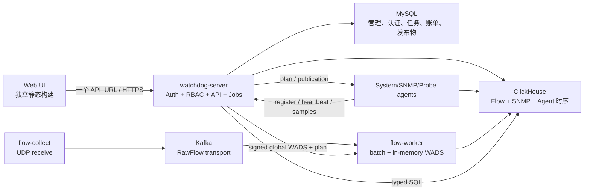

# Watchdog KISS 目标架构：单域、双存储、三层口径

> 状态：ADR-KISS-001，目标架构已冻结（2026-09-08）。本文取代旧文档中“PocketBase 认证内核”“多租户”“VictoriaMetrics + ClickHouse 双分析后端”“通用 module/resource/dataset provider 平台”的目标形态。实施清单见 [watchdog-kiss-refactor-tasklist.md](watchdog-kiss-refactor-tasklist.md)。

## 1. 决策结论

Watchdog 不是通用 SaaS 平台。它是一个自托管的网络与流量分析系统，产品核心只有五件事：

1. LibreNMS 式的用户、角色、权限、设备、端口和账单管理；
2. 多种 agent/collector 的安全注册、能力协商、配置下发和健康观测；
3. 高吞吐 Flow 接收、Kafka 缓冲重放、可靠入库和完整性对账；
4. 全局地址/地域/运营商资料的导入、编辑、发布和内存查询；
5. 原始、供应商、客户三层可解释口径，以及准确的流量流向、固定报表和结算对账。

据此冻结以下目标：

| 主题 | 唯一决策 |
|---|---|
| 重构优先级 | PocketBase 彻底移除是第一阻断项；完成前不推进其他平台重构包 |
| 部署边界 | 单一部署域，不存在 tenant、tenant module 或跨租户发布 |
| 认证授权 | MySQL 本地用户、session、RBAC；不再使用 PocketBase |
| 管理数据 | MySQL 是唯一可变管理事实源 |
| 时序与分析 | ClickHouse 保存 Flow、SNMP、system/agent 时序；不再使用 VictoriaMetrics/VictoriaLogs |
| 消息传输 | Kafka 只负责 Flow 的削峰、解耦和有限重放，不是查询数据库 |
| 地址发布 | 保留现有 MMDB/IPDB -> MySQL -> WADS 全链；只改为全局管理员维护 |
| 查询 | `FlowQueryService` 与 `MetricQueryService` 直接查询 ClickHouse；不保留 provider registry |
| 设备 | 一个 `devices` 根对象；取消 `target -> network_device` 双层身份 |
| 扩展 | 扩展点在 agent capability/plan 协议，不建设动态业务模块平台 |
| 前端界面 | 保持现有 UI、导航、布局、组件和视觉风格；只替换 PB 数据/认证接线 |
| 数据迁移 | 已确认没有业务数据需要迁移；采用干净 schema 和一次切换，不做 backfill/双写/shadow read |

“只使用 MySQL + ClickHouse”指持久数据权威只有这两类。Kafka 是传输日志；进程本地 LKG 文件是可删除缓存；前端静态文件和 MIB 文件是构建制品，都不是第三个数据权威。

## 2. 当前代码审查

### 2.1 复杂度不是业务复杂度，而是重复抽象

下列内容是 2026-09-15 重构前审计快照，所列旧 package/schema 已在 KISS-08H/I 删除，不再是当前运行结构：

- 历史 `install/init.sql` 有 89 张 MySQL 表，其中 77 张带 `tenant_id`；该文件已删除；
- PocketBase 相关 Go 代码分布在 58 个文件，前端 PB transport/auth/collection 引用分布在 75 个文件；
- VictoriaMetrics 相关实现、配置和测试分布在 52 个文件；
- 历史 `internal/hub` 的 Hub 直接内嵌 PB `core.App`，同时承担 HTTP、认证、SQLite collection、hook、cron 和 realtime；该目录已删除；
- MySQL `users` 已被改成 PB 的授权投影，`password_hash` 已删除，因此当前生产登录仍离不开 PB；
- `targets` 与 `network_devices` 为同一网络设备保存两层 ID、状态和生命周期；
- 历史 `internal/watchdog` 的 module/resource/target/dataset/provider registry 为不存在的多租户通用平台付出持续复杂度；该 package 已删除；
- SNMP/system 时序写 VM，Flow 写 CH，查询再由通用 gateway 路由到两个 provider，导致配置、权限、健康、导出和错误语义重复。

这些结构不是 Flow、SNMP 或账单本身需要的复杂度。继续在其上补兼容层，只会让一次功能修改横跨身份投影、tenant、module、provider 和两个存储。

### 2.2 成熟项目应学习的部分

LibreNMS 值得学习的是稳定的领域骨架，而不是复制所有字段：

- 用户通过角色/权限访问设备、端口和 bill；
- `devices` 是库存根，`ports`、IP 地址、BGP、sensor、inventory 均从属于设备；
- SNMP 凭据是设备连接配置，`sysName/sysDescr/os/hardware` 是发现结果；
- bill 关联端口，周期计算保存结果和历史，不在页面临时拼出结算值。

Akvorado/goflow2 值得保留的是数据面分工：接收、Kafka、模板解码、批量 worker、ClickHouse、可组合查询。当前已经实现的自研 sFlow v5/NetFlow v5 fast decoder 也属于冻结成果，不能在平台重构时退回通用反射解码。EdgeManager 值得保留的是地址资料先编译成版本化二进制，再由无数据库热路径加载到内存，而不是逐 Flow 查 MySQL。

## 3. 第一性原理与架构不变量

1. **一个事实只有一个权威。** 管理对象在 MySQL；时序事实在 ClickHouse；Kafka offset 只表示传输位置。
2. **热路径不访问管理库。** Flow decode、分类、计数和 CH block 写入均不查 MySQL/HTTP。
3. **客户不是租户。** 客户、供应商、运营商是分类和账单维度，不是认证隔离边界。
4. **扩展 agent，不扩展 core 元模型。** 新 agent 声明 capability；core 不动态生成资源类型、数据集、权限树和导航。
5. **原始事实不可被修正覆盖。** supplier/customer 是带版本、原因和操作者的派生口径。
6. **账单只读冻结结果。** 每个结算周期固定查询窗口、端口、算法、口径和 publication version；关闭后不可静默重算。
7. **异步工作只有一个状态机。** import、publish、export、downsample、repair、历史重分类都复用 `operation_jobs`。
8. **没有硬编码 30 天。** 保留和降采样是显式全局策略；没有完整性门禁时不得物理删除原始 Flow。
9. **失败必须可见。** 缺采样率、缺 publication、Kafka lag、CH 部分写、SNMP counter reset 都不能用 0 或 customer 值冒充成功。
10. **平台重构不改 UI。** 路由、导航、页面布局、主题、组件风格、图标和既有交互保持不变；前端只更换认证、API client 与数据状态来源，非必要界面文件变更属于越界。

## 4. 目标运行架构



生产进程保持少而清楚：

- `watchdog-server`：纯 Go HTTP 服务，负责认证、RBAC、管理 API、查询、任务调度和可选的静态 UI 托管；
- `watchdog-system-agent`、`watchdog-snmp-agent/collector`、`watchdog-probe-agent`：按能力注册；
- `watchdog-flow-collect`：只做 UDP 接收、来源准入、RawFlow envelope 和写 Kafka，不做协议解码；
- `watchdog-flow-worker`：按 partition 有序执行当前 fast/GoFlow2 decode、内存分类、批量写 CH、提交 offset；
- aggregate rollup 与 export 统一由 server 内的 `operation_jobs` worker 执行；旧 `watchdog-aggregate-rollup` / `watchdog-export-worker` 已删除，禁止恢复第二套任务状态机或依赖旧 tenant/collector 表的进程。

不再存在 PB server、PB SQLite、VM、VLogs、通用 provider 服务或第二套 Flow job 状态机。

## 5. 领域边界

### 5.1 Core：认证、RBAC、任务、审计

Core 只拥有：

- `users / sessions / roles / permissions / user_roles / role_permissions`；
- `user_device_permissions / user_port_permissions / user_billing_permissions`；
- `operation_jobs / audit_logs / idempotency_records / export_tasks`；
- 全局配置和安装状态。

本地认证只实现当前产品需要的闭环：`users.password_hash` 使用 bcrypt；登录生成 32-byte 随机 session token，浏览器只持有 `HttpOnly + Secure + SameSite=Lax` cookie，MySQL `sessions` 只保存 token SHA-256、用户、创建/最后活动/过期/吊销时间和客户端摘要。这里的 session token hash 是低频安全边界，与已删除的逐 Flow record hash 无关。状态修改使用 CSRF token；禁用用户立即拒绝其全部 session。首个 administrator 只由 `POST /api/v1/install` 在空库创建，不内置默认密码；旧 `watchdog-install` CLI 已删除。暂不复刻 PB 的 OAuth、OTP/MFA、找回邮件和 realtime collection；以后如需 SSO，替换 session authenticator，不恢复 PB。

前端启动只读取公开页面和本地 session 状态；访问受控 API 得到 401 或用户主动点击登录时才显示登录页。不得在页面加载时自动提交登录、刷新无效 token或循环调用认证接口。

权限模型直接参考 LibreNMS 的两级判定，但不用其历史 `level` 字段和 Bouncer polymorphic schema：

1. `permissions` 是固定 ability 目录，`role_permissions` 把 ability 授给角色，`user_roles` 把角色授给用户；
2. `user_device_permissions / user_port_permissions / user_billing_permissions` 是可见资源集合；
3. 请求必须同时通过“是否允许该动作”和“是否允许该资源”两道门；administrator 或对应 `*.viewAll` 才能绕过资源集合；
4. 端口权限继承设备权限：拥有 device grant 即可访问该设备全部端口，或者只授予单独 port；
5. bill 只由 `user_billing_permissions` 控制，不因能看到 bill 所关联端口就自动获得财务权限；
6. Flow 没有高基数逐记录 ACL 表：其设备/端口范围复用上述资源集合，数据口径再由固定 Flow ability 控制。

这与 LibreNMS `DevicePolicy`、`PortPolicy`、`BillPolicy` 以及 `devices_perms/ports_perms/bill_perms` 的核心思路一致，同时修正其部分 update/delete 只检查全局 action、未再次检查对象范围的宽授权风险：Watchdog 的 view/update/delete/export 都必须做对象范围交集。

固定 ability 至少包括：

| 域 | ability |
|---|---|
| user/role | `user.view/create/update/delete/manage`, `role.view/create/update/delete` |
| device | `device.view`, `device.viewAll`, `device.create/update/delete`, `device.discover` |
| port | `port.view`, `port.viewAll`, `port.update` |
| billing | `bill.view`, `bill.viewAll`, `bill.create/update/delete`, `bill.calculate`, `bill.reconcile`, `bill.approve`, `bill.export` |
| Flow 口径 | `flow.view.customer`, `flow.view.supplier`, `flow.view.raw` |
| Flow 操作 | `flow.export.customer`, `flow.export.supplier`, `flow.export.raw`, `flow.reclassify`, `flow.probe` |
| platform | `agent.view/manage`, `address.view/manage/publish`, `job.view/manage`, `audit.view` |

Flow 查询的最终授权公式为：

```text
allow = has(flow.view.<layer>)
     AND requested_device_ids subset-of visible_device_ids
     AND requested_port_ids subset-of visible_port_ids
```

`visible_port_ids` 是显式 port grant 与可见设备下全部端口的并集。未显式选择 device/port 时，查询编译器必须自动下推可见集合；不能因为筛选为空就查询全库。administrator 可见全集。地址资料维护额外要求 `address.manage`，发布要求 `address.publish`；默认 administrator 同时拥有二者。

默认角色建议固定为：

| 角色 | 权限范围 |
|---|---|
| administrator | 全部管理和敏感口径 |
| operator | 设备、agent、采集和告警；不能改地址发布/账单审批 |
| analyst | Flow/SNMP 查询、图表和授权导出 |
| billing | 账单、三层对账、周期关闭和导出 |
| viewer | 只读 customer 口径和设备状态 |

### 5.2 Inventory：一个设备根

`devices` 同时覆盖网络设备与安装 agent 的主机，`kind` 仅用于 UI/采集策略，不创建第二类 target。网络设备添加只要求唯一 `host`；display name 可空，发现后优先显示 `sys_name`。

设备下属对象：

- `ports`：ifIndex、名称、别名、速率、管理/运行状态和发现时间；
- `interface_addresses`：IPv4/IPv6、prefix、VRF/context；
- `bgp_sessions`：IPv4/IPv6 AFI/SAFI、对端 AS、状态和前缀数；
- `sensors / physical_entities / vlans / lag_groups`；
- `snmp_profiles` 与设备连接设置；community/v3 secret 加密保存，sysName/sysDescr 永远不是输入必填；
- MIB/OS/module 定义以版本化构建资产为主，只为用户上传的自定义 MIB 保存最少元数据。

**设备组织按 LibreNMS 来**（不只是权限，还服务于组织、地图和告警范围）：

- `locations`：站点/POP（名称、经纬度、地址），`devices.location_id` 归属；
- `device_groups`：`static`（显式成员）与 `dynamic`（按 kind/status/vendor/model/platform/os/location/label 的 typed rule 匹配）两类；用于导航分组、告警范围和权限授予的批量单位（对应 §5.1 的 `user_device_group_permissions`，把"授一个组"而不是"授 500 台设备"作为常规做法）；`device_group_members` 同时保存静态成员与动态规则的物化结果，设备变更和显式 refresh 都重算物化关系，读路径不解释任意 SQL/JSON 表达式；
- 设备状态变化/发现/采集的**事件时间线（eventlog）与告警日志不放 MySQL**：它们属于后续单独实现的"日志与告警"子系统，按 LibreNMS 的 eventlog/alert 表结构落在 **ClickHouse**（高频、只追加），设备详情的历史视图查 CH（见 §6.2 与 §11 后续项）。

设备、端口、BGP、inventory 的服务端分页/搜索/排序/filter 继续保留；这是 UI 能力，不需要通用 resource registry。设备与端口的字段口径参考 LibreNMS（device: `host/sys_name/os/version/hardware/serial/sysObjectID/status/disabled/uptime/last_polled/location_id/kind`；port: `device_id/if_index/if_name/if_descr/if_alias/if_speed/if_oper_status/if_admin_status` 及 in/out octet 原值），但只保留产品实际使用的列。

设备详情的 MySQL inventory API 固定为 `/devices/:id/{ports,addresses,bgp,sensors,inventory,vlans,lags,events}`，设备 SNMP 设置/发现固定为 `/devices/:id/snmp` 与 `/devices/:id/snmp/discover`，端口与 BGP 固定为 `/ports/:id`、`/bgp`。`/network/devices`、`/network/ports`、`/network/bgp` 和 `/targets` 兼容路由已在前端切换后删除，不设第二套 URL、DTO 或 repository。端口 scope 使用两级并集：`device`/device-group grant 继承全部端口，显式 `user_port_permissions` 只放行指定端口。端口、接口地址、BGP 与硬件清单是当前发现状态；counter/rate、sensor 时序和事件/告警事实只进 ClickHouse，禁止在 MySQL 再造时序副本。

SNMP 采集实现不是重构对象。现有 MIB 驱动发现、OS/module definition、v1/v2c/v3 会话、poll recipe、IPv4/IPv6/BGP/sensor/inventory 采集、counter 原值和 agent/collector 调度语义全部保留。平台重构只做两类机械接线：把管理外键从旧 target/device ID 改到唯一 `device_id`，把时序 writer/query 从 VictoriaMetrics 改到 ClickHouse；不得趁机改 OID 规则、设备识别、轮询频率或 counter 算法。

SNMP 手工发现入口固定为 `POST /api/v1/devices/:id/snmp/discover`。服务端按 profile 默认值与 device override 合并连接参数，然后调用上述既有 discovery engine；成功结果在一个 MySQL 事务内更新 device fingerprint 和当前态 ports/interface addresses/BGP/sensors/physical entities/VLAN/LAG。只有某模块明确进入 `completed_modules` 才替换/裁剪该模块结果，模块失败不能把上次有效清单误删。消失且未被引用的端口可删除；被 `billing_account_ports` 引用的端口必须保留并标记 `notPresent`。发现失败写 device status/reason 与 audit，不产生半批 inventory。poll recipe、counter/rate、事件和告警不在这里落 MySQL：recipe/agent 调度归 KISS-03/04 接线，时序及 eventlog/alerts 归 ClickHouse。

`locations.name/address` 是管理员维护的站点/POP，`devices.sys_location` 是设备通过 SNMP 上报的原文；API 分别返回 `location_name` 与 `sys_location`，禁止用其中一个覆盖另一个。OS/vendor/model 只来自版本化 LibreNMS definition/MIB capability 与设备指纹，不按某个厂商在 handler 中拼接判断。未配置外部 definitions 时仍加载内嵌标准 MIB，保证 IF/IP/BGP/ENTITY 的通用发现；`snmp.definitions_dir` 与 `snmp.mib_dirs` 只负责叠加定义资产。

### 5.3 Agent：注册协议是唯一扩展点

Agent 固定使用以下生命周期：

`enrollment token -> registered -> active -> draining -> revoked`

最小模型：

- `agents`：kind、name、software/API version、capabilities、health、last_seen、desired/acked plan version；
- `agent_credentials`：单次 enrollment、token hash 或 mTLS fingerprint、轮换和吊销；
- `agent_bindings`：agent 与 device、collector endpoint 或 worker role 的关系；
- `agent_plans`：不可变版本、schema version、payload、签名、创建者；
- `agent_plan_acks`：downloaded/installed/failed 和错误；
- `agent_runs`：需要追溯的 discovery/probe 执行摘要。

capability 是版本化字符串与有界 JSON 参数，例如 `snmp.poll/v2`、`flow.receive.sflow/v1`、`flow.write.clickhouse/v2`。控制面只有一个 `AgentKindAdapter` 代码接口负责 validate/plan/status；不为每个 agent kind 注册一套 dataset、resource、target 和菜单。

注册/CRUD 第一纵向切片固定以下约束：agent kind 只有 `system/snmp/flow_collect/flow_worker/probe`；API version 当前只接受 `v1`，且 capability 必须包含与 kind 对应的版本化前缀。enrollment token 是一次性的，并固定允许的 kind 与可选 `device_id`；没有 `device.viewAll` 的管理者只能为自己有权访问的具体设备签发 token，不能签发可绑定任意设备的 token。`system` 只能绑定 host device，`snmp` 只能绑定 network device；collector/worker 可不绑定具体设备。machine token 仅在创建或轮换响应显示一次，MySQL 只保存 SHA-256；mTLS 只保存证书 SHA-256 fingerprint。

`row_version` 表示管理配置版本：创建、编辑、凭证轮换、吊销以及首次 `registered -> active` 转换会改变它；稳定 heartbeat 和 run 上报不会每分钟制造配置冲突。轮换和吊销在同一事务内锁定 agent、复核版本并更新凭证；旧 credential 在新 credential 生效前已吊销。生产 machine API 只有 Gin `POST /api/v1/agents/register` 与 `/api/v1/agents/:id/{heartbeat,status,errors}`。历史 system plan/sample 暂留原实现，直到 KISS-03 把其输入输出逐项迁入 Gin+ClickHouse 后才删除。

现有 fleet rollout 的复杂状态机不作为基础能力。批量下发先由一个 `operation_job` 对选定 agent 逐个创建 plan；只有出现真实的灰度发布需求和故障证据后，才增加 canary 数据模型。

### 5.4 Address/Geo：保留现有实现，只去 tenant

Geo/地址库已经是可用的数据产品，不属于平台重写范围。现有二进制 MMDB/IPDB 上传、异步解析、MySQL 落库、Geo/线路/运营商/地址段/地址集合 CRUD 与列表、集合运算/校验、draft/revision、审批/激活/回滚、WADS 编码、签名、object store、worker 下载/LKG/ACK/atomic swap 全部保持原实现和数据语义。

KISS 改造只有一个变化：地址库没有 tenant，也没有 owner tenant。删除相关表和 API 的 `tenant_id`/owner 参数及其权限适配，改为全局资源；拥有 `address.manage` 的管理员能够导入和编辑，拥有 `address.publish` 才能审批、发布和回滚。其他角色只能读取活动目录和版本状态。除这项单域化外，不改表的业务字段、CRUD/list 请求响应、job payload、WADS v1 字节协议或发布生命周期。

流程固定为：

1. 上传二进制 MMDB/IPDB，创建现有 address import；
2. operation worker 异步解析、规范化 CIDR、验证 v4/v6、记录重复/覆盖/冲突和结果；
3. 管理员在全局 draft 中编辑 Geo 层级、线路、运营商、地址集合和 include/exclude；
4. preview 计算并/交/差、最长前缀覆盖、最坏展开量和 publication diff；
5. publish job 固定 draft revision，编译确定性 WADS，校验后写不可变 publication；
6. 活动版本原子切换；worker 下载、验证、写本地 LKG 并 ACK；
7. Flow 热路径只在内存中做 LPM/区间查询和 atomic pointer swap。

MySQL 继续保存导入后的可编辑地址数据、draft/revision、publication 元数据、版本关系和 ACK；WADS 继续写现有有界 immutable object store，不改成 MySQL `LONGBLOB`。object store 中的 WADS 是由 MySQL 数据确定性编译出的发布制品，不是第三套可查询数据库；worker 的 LKG 仍只是断网启动缓存。现有约 4.3 MiB 的产物大小、SHA/CRC/signature、资源硬限和 GC 契约全部保留。

### 5.5 Flow：保留已经验证的数据面

下列数据面不因平台重构而重写：

1. 当前 `internal/flowstream` 解码组合：自研零反射/零分配的 sFlow v5 与 NetFlow v5 fast path；GoFlow2 负责 NetFlow v9/IPFIX template 解码，以及 fast path 未覆盖记录的回落；
2. Kafka 作为 RawFlow 唯一传输队列和重放边界；
3. worker 批量消费、内存 WADS/规则匹配、批量 CH native insert；
4. 至少一次消费以 Kafka `(topic, partition, offset, record_index)` 作为事实身份；
5. reconciliation 用 offset window 的 record count 与 raw/estimated byte/packet counters 对账；
6. 不在逐记录写路径重新引入 record hash/content checksum/DB 查询；
7. 完整性、采样率未知、迟到和 repair generation 明确进入查询 provenance。

单域化只删除事实和查询中的 `tenant_id`，不得顺带改变 fast decoder、GoFlow2 template/sampling store、Kafka 坐标去重、receipt、WADS lookup、计数语义或批写策略。该变更必须是一个独立切片，并复跑 fast-vs-GoFlow2 差分、四协议 pcap、现有吞吐、故障注入、count/counter 守恒和查询回归。

### 5.6 三层口径不是多租户

| 口径 | 含义 | 存储/可变性 |
|---|---|---|
| raw | exporter 原始 tuple、counter、采样元数据和 Kafka provenance | 永不覆盖；作为可复算事实根 |
| supplier | 按供应商 Geo/ASN 资料对 raw 归集的结算基线 | live facts 保存版本化基线；历史重分类写隔离 generation |
| customer | 在 supplier 之上应用地址/Geo/ASN/ISP/业务归属覆盖 | live facts 保存最终值与 override provenance；历史重分类写隔离 generation |

CH 的 `flow_records` 保持 exporter raw tuple/counter/Kafka provenance 不可变，同时保存入库时已发布 AddressSnap/classification 产生的 supplier 基线、customer 最终值和版本证据。规则更新不 `ALTER/UPDATE` base，也不在查询请求中临时扫描并改写历史。需要按新 publication 重算历史时，唯一允许路径是 FLOW-06B：异步读取仍在线的 raw facts，写入按 `(reclassification_id,generation)` 隔离的派生投影，经 Kafka 坐标与 count/counter 守恒后原子激活；失败或取消不改变默认事实。原始事实已销毁且没有可验证重放源时拒绝重分类。

账单是唯一需要冻结的场景（见 §5.7 与不变量 6）：账单在计算时按对手方维度从 raw 归集，关闭时快照当期结果、规则版本、地址发布版本和采样完整度，使已关闭周期可复算。地址/地域/运营商富化仍在采集入库阶段由内存 WADS 完成（见 §5.4），与这里的口径修正是两件独立的事。

### 5.7 Billing：冻结结果，三方对账

账单借鉴 LibreNMS 的 bill + ports + period/history，但增加 Flow 所需的口径证据：

- `parties`：customer/supplier，不承担登录或隔离；
- `billing_accounts`：counterparty、bill type、billing day、direction、算法、额度、`raw|supplier|customer` 取值策略，以及端口固定价或 95th Mbps 单价/币种；金额字段使用精确十进制；
- `billing_account_ports`：账单与端口/方向关系；
- `billing_periods`：时间窗、状态、固定算法与 publication version；
- `billing_period_values`：raw/supplier/customer、SNMP interface counter、对方导入值及差值；
- `billing_adjustments`：人工调整值、原因、证据、操作者和审批；
- `reconciliation_runs/issues`：覆盖率、缺采样、counter reset、缺失桶、超阈值差异。

SNMP 不负责 ASN/IP/地域流向分类；Flow 单独即可回答这些问题。SNMP 的账单价值是提供独立的接口总字节计数，用来和 Flow estimated total 对账。差异可能来自采样、Flow exporter 覆盖、方向映射、counter reset、丢包或时间窗，不得自动把 Flow 改到与 SNMP 相等。

周期关闭必须保存：窗口/时区、端口集合、算法（95th/average/total 等）、每层结果、采样完整度、SNMP 覆盖、所有 publication/generation、调整和审批人。导出同时给出三层值与差异，保证“为什么向供应商付这个数、为什么向客户收这个数”可追溯。

## 6. 双存储数据模型

### 6.1 MySQL：只保存可变管理状态

目标表按领域组织。表数量不是 KPI；禁止的是重复身份和通用元模型。

| 领域 | 目标表 |
|---|---|
| auth/RBAC | `users`, `sessions`, `roles`, `permissions`, `user_roles`, `role_permissions`, `user_device_permissions`, `user_port_permissions`, `user_billing_permissions`, `user_device_group_permissions`, `user_preferences` |
| operations | `operation_jobs`, `audit_logs`, `idempotency_records`, `export_tasks`, `watchdog_installation`, `settings`（全局配置：保留期/阈值/默认口径等） |
| inventory | `devices`, `ports`, `interface_addresses`, `bgp_sessions`, `sensors`, `physical_entities`, `vlans`, `lag_groups`, `snmp_profiles`, `locations`, `device_groups`, `device_group_members`, optional `custom_mibs` |
| agents | `agents`, `agent_credentials`, `agent_bindings`, `agent_plans`, `agent_plan_acks`, `agent_runs` |
| address | 保留现有 `address_*`, `geo_dict`, `geo_lines`, `isp_operator*`, `dimension_snapshot*`, `flow_enrichment_publication*` 业务表和字段；仅删除 tenant/owner 包装 |
| flow control | `flow_classification_profiles`, `flow_vpn_rules`, `flow_vpn_findings`, `flow_saved_filters`, `flow_storage_policy` |
| presentation | `saved_charts`, `chart_items`, `dashboards` |
| billing | `parties`, `billing_accounts`, `billing_account_ports`, `billing_periods`, `billing_period_values`, `billing_adjustments`, `reconciliation_runs`, `reconciliation_issues` |
| alerts | 无旧表；告警规则/投递配置/事件/日志将按 LibreNMS 结构由后续 KISS-L 独立建立，时序事件存 ClickHouse，低频规则与投递配置按需存 MySQL（见 §6.2、§11） |

所有表删除 `tenant_id`。所有人工可写对象保留 `row_version`、`created_by/updated_by`、`created_at/updated_at`；软删只用于确有恢复/审计需要的对象，不作为默认模板。

### 6.2 ClickHouse：统一时序与分析

Flow 表继续由 `internal/flowch` 的现行 Storage V2 契约管理，单域切片只移除 tenant 维度。

KISS-03 按真实数据源分片迁移，不为延期功能预建通用抽象。SNMP 先使用一个原始时序表和一个账单专用派生表：

- `snmp_samples`：`observed_at, ingested_at, device_id, agent_id, entity_kind, entity_id, recipe_id, metric, value_kind, gauge_value, counter_value, counter_width, interval_ms, quality_flags, poll_sequence, source_run_id, sample_index`；
- `snmp_interface_traffic_5m`：从连续原始 counter 计算的 in/out bytes、bps、reset/gap 标志、coverage 和 repair generation，供图表、95th 和对账；
- system/container agent 延后时再按其真实字段冻结显式表和 API，不用 `source_kind` 把不同语义提前塞进一张万能表；低频遥测事件也只在实际需求落地时建表。
- **日志与告警（后续单独实现）**：按 LibreNMS 的 `eventlog`/alert 表结构在 ClickHouse 存储设备事件、告警日志与告警状态，只追加、高频、可 TTL；查询也在 CH。告警规则定义等低频管理配置由该子系统按需放 MySQL。本期不实现，只先确定其存储归属为 CH（对应 §11 后续项）。

`snmp_samples` 使用 poll sequence + source run + sample index 的自然坐标实现幂等，不使用业务含义 hash。counter rate 必须按设备 counter width、wrap/reset、实际 poll interval 和缺口计算；账单只使用 closed 5m bucket。保留期为全局配置，变更由受审查的 CH migration 执行，不在表 DDL 硬编码 30 天，也不在 MySQL 保存时序副本。详细契约见 [kiss03-snmp-clickhouse-design.md](kiss03-snmp-clickhouse-design.md)。

这是 SNMP storage adapter 替换，不是 collector rewrite：collector 产出的 metric name、entity identity、raw UInt64 counter、timestamp、interval 和 quality 必须原样进入 CH adapter；新旧 sink 的相同输入测试向量除存储编码外必须一致。

### 6.3 明确删除/合并

| 当前结构 | 目标动作 |
|---|---|
| PocketBase、`internal/hub` PB hooks/collections、前端 PB SDK | 删除；纯 Go server + MySQL session |
| `tenants`, `tenant_modules`, tenant header/context/grant | 删除，不 PIN 常量 tenant |
| `targets` + `network_devices` | 合并为 `devices` |
| `target_agents` + `collector_bindings` | 合并为 `agent_bindings` |
| collector enrollment/service principal/ownership/rollout/signing/trust 多套表 | 收敛为 agent credential/plan/ack；真实需要的签名 key 作为单一平台 key 管理 |
| `ModuleRegistry/ResourceRegistry/TargetKindRegistry` | 删除；领域路由和固定权限 |
| `DatasetRegistry/QueryProviderRegistry/query_dataset_policies` | 删除；两个 typed CH query service + 代码配置预算 |
| VictoriaMetrics client/provider/export/delete-series/config | 删除；CH telemetry service |
| `discovery_jobs`、Flow 私有 job 状态 | 使用 `operation_jobs` 的 typed job handler |
| 多表 aggregate graph 元模型 | 收敛为 `saved_charts + chart_items + dashboards`，查询定义使用领域 typed schema |
| tenant-owned AddressSnap/publication | 仅移除 tenant/owner 权限包装；现有 MySQL CRUD、WADS/object/LKG/ACK 发布链不变 |

## 7. API 与前端边界

HTTP API 只按领域暴露：

| 路径 | 用途 |
|---|---|
| `/api/v1/session/*` | login/logout/current/password change；无默认后台登录请求 |
| `/api/v1/users`, `/roles`, `/permissions` | 全局 RBAC |
| `/api/v1/devices/{id}/...` | device、port、IP、BGP、health、switching、inventory、events |
| `/api/v1/snmp/profiles` | SNMP profile CRUD；列表不返回 security，详情仅授权设备管理员读取 |
| `/api/v1/agents`, `/api/v1/agents/{id}` | agent 管理 CRUD、binding 与 run 列表（用户 session + `agent.view/manage`） |
| `/api/v1/agents/enrollment-tokens`, `/api/v1/agents/register` | 管理员签发固定 kind/可选 device scope 的一次性 enrollment secret；agent 消费后仅返回一次 machine token |
| `/api/v1/agents/{id}/{heartbeat,status,errors}` | agent token/Bearer 认证的运行面入口，不接受用户 session 代替 machine credential |
| `/api/v1/address-library/...` | import、draft、preview、publish、rollback、status |
| `/api/v1/flow/query` | Explorer typed query |
| `/api/v1/flow/reports/{overview,dimensions,source,destination,overseas,vpn}` | 固定运营报表 |
| `/api/v1/flow/records/{search,facets}` | raw/supplier/customer 明细 |
| `/api/v1/billing/...` | account、period、calculate、reconcile、approve、export |
| `/api/v1/jobs`, `/audit`, `/exports` | 统一异步操作和审计 |

删除通用 `/query` 的 `dataset/provider/tenant` envelope。保留现有 Flow typed compiler、能力白名单、扫描预算、全有或全无响应和 report composition；它们下沉为 Flow 域内部实现。设备指标使用固定 metric allowlist 的 `MetricQueryService`。

设备管理的唯一权威路径是 `/api/v1/devices`，`host` 唯一且是创建时唯一必填身份字段。数据库内部用 `host` 表示 system device，API 为保持产品词汇稳定返回 `kind=system`；`target_id == device_id` 只保留为现有 DTO 的同值字段，不存在 `targets`、`network_devices` 或 `target_agents` 表及双写。旧 `/api/v1/network/{devices,ports,bgp}`、`/api/v1/network/traffic-policy-defaults` 和 `/api/v1/targets` 已删除。Agent 不保留 `/api/v1/agent-registry` alias，前端与五类 agent 实进程只访问 canonical `/api/v1/agents...` Gin/MySQL 路径。

前端是独立 npm 构建，只读取一个 `WATCHDOG_CONFIG.API_URL`。`npm run dev` 直接调用配置的 API；生产是否由 Go 同进程提供 `dist` 只是部署便利，不引入第二个 HUB_URL、同源 proxy 或专用 static server。收到受控 API 的 401 或用户主动点击登录时才显示/提交登录，不在应用启动时尝试认证。去 PB 只替换 transport、auth state 和数据获取；现有路由、导航、页面布局、主题、组件、图标和交互保持不变。该切片只做 API/认证功能测试，不增加视觉测试。

## 8. 生命周期闭环

### 8.1 数据生命周期

- MySQL 管理对象：创建/修改写审计；删除前 preview，物理销毁由 operation job 执行；
- Flow raw：默认不因旧 30 天设定自动删除；先满足 Kafka coverage、receipt count/counter、archive/repair 门禁，再按显式 policy 删除整分区；
- SNMP raw：按全局 retention 用 CH TTL；账单周期引用的 5m bucket 保留期不得短于账单审计期；
- publication：不可变，活动指针可回滚；仅未引用且超保留窗版本可 GC；
- billing period：open 可重算，approved/closed 不可覆盖，只能新增 adjustment 或 reversal。

### 8.2 操作生命周期

所有长任务返回 `202 + job_id`，状态统一为 `queued/running/succeeded/failed/canceled`，具备幂等键、lease、heartbeat、retry、cancel、progress、结果摘要和审计。地址导入/发布失败不得改变 active publication；Flow repair/reclass 失败不得改变可见 generation；billing calculate 失败不得部分关闭周期。

### 8.3 功能生命周期

新能力只能以完整纵向切片进入：schema/contract -> backend -> UI -> unit -> real MySQL/CH/Kafka integration -> change test -> regression -> commit。禁止先增加 registry/table/feature flag 占位，再长期等待业务实现。

## 9. 无数据切换策略

不在 89 张旧表上逐列手术，也不写 PB/VM 历史搬迁器。PocketBase 删除优先于设备、tenant、VM/provider 等后续收敛：

1. 冻结一切新增 PB 依赖，盘点认证、HTTP、collection/hook/cron/realtime、agent、telemetry、alert 和前端调用，形成“迁入目标架构 / 确认死亡并删除”的精确清单；
2. 建立最小 MySQL v2 auth schema，完成纯 Go server、本地认证、session/CSRF 和唯一管理员初始化；
3. 前端切换为单一 `API_URL` fetch client，只在主动登录或受控 API 返回 401 时发起登录，删除 PB SDK/collection/realtime；
4. 只迁移仍然存活的 agent 最小入口；旧 alert/systems/smart_devices/realtime/hook/cron/collection 写链直接删除，不做历史搬迁；
5. 从 Go/JS 依赖、源码、配置、构建、运行和数据目录中物理删除 PocketBase；按精确白名单删除 PB SQLite 和仅服务旧平台调试的数据库；
6. 在无 PB binary、env、SQLite、端口和请求条件下，从空 MySQL 启动并完成登录/agent/健康检查，KISS-01 到此才完成；
7. 随后才建立设备根、将 SNMP 新鲜时序接 ClickHouse、去 tenant/provider/VM，并将全局地址发布与 Flow 管理面接到 v2 schema；
8. 以仅 MySQL + ClickHouse + Kafka 的空库完成全产品端到端验收。

### 9.1 删除授权与安全边界

用户已明确授权删除无用/死亡代码和执行 `DROP DATABASE`，且确认没有业务数据需要迁移。该授权用于直接清除已核实的旧架构，不要求为无数据系统建设 backfill、双写或历史备份流程；但它不等于模糊删除授权。

每个破坏性步骤必须先只读记录数据库引擎、精确库名、用途、配置/代码引用、运行进程和活动连接，并进入当前工作包的删除白名单。禁止通配、模糊名称、宽目录、未解析环境变量；禁止删除 MySQL/ClickHouse 系统库、EdgeManager 库、备份库或并行任务正在使用的开发/测试库。目标不存在可以幂等跳过；身份或归属不匹配必须 fail closed。实际文件删除和 DROP 结果写入对应工作包的提交证据，不留到最终大扫除。

v2 schema 的唯一基线目录是 `deploy/schema/mysql`，由 server 原位嵌入并按连续版本执行；旧 migration 与 `install/init.sql` 只保留在 Git 历史。新安装不得运行第二套 schema。

## 10. 性能、可靠性和准确性门禁

### 10.1 Flow 数据面

- 现有 sFlow v5/NetFlow v5 fast path、GoFlow2 v9/IPFIX/fallback、Kafka/batch CH 基线不得退化；
- 每条 Flow 零 MySQL/HTTP 查询、零新增逐记录 hash；
- 崩溃/rebalance/假 ack 重放后 Kafka 坐标唯一，`FINAL` count/counters 收敛；
- reconciliation 按 partition/offset 检测 missing receipt/records、count、byte/packet counter mismatch；
- WADS 加载失败保留 LKG，发布 atomic swap；现有 lookup/内存/swap 基准继续作为门禁。

### 10.2 SNMP 与账单

- 原始 UInt64 counter 不经 Float64 丢精度；
- rate 对 wrap/reset/gap/实际 interval 有确定性测试；
- 5m bucket 的边界、时区和缺失覆盖可解释；
- 同一账单周期重复计算结果确定，关闭后不可变；
- Flow/SNMP/对方导入值三方对账显示绝对差和比例差，不静默调平。

### 10.3 静态完成门禁

目标分支最终必须满足：

- Go module 和源码无 `pocketbase`；前端无 PocketBase SDK/API；
- schema、API DTO、查询和权限无 `tenant_id`、tenant header 或 tenant selector；
- 运行配置、代码和测试无 VictoriaMetrics/VictoriaLogs provider；
- 不存在 `DatasetProvider`、`query_dataset_policies` 或 target/network-device 双 ID；
- clean install 只要求 MySQL、ClickHouse、Kafka；
- `go test ./...`、race/vet/build、前端 lint/test/build、真实依赖集成全部通过。

## 11. 非目标

- 不实现 SaaS 多租户、跨组织委派或 tenant billing；
- 不 fork PocketBase，也不复刻 OTP/OAuth/realtime collection；
- 不做运行时 Go plugin、动态菜单/数据集/资源元模型；
- 不为了“以后也许需要”保留 VM/provider 抽象；
- 不重写已验证的 Flow collect/Kafka/worker/CH/WADS 算法；
- 不把客户/供应商修正变成权限 tenant；
- 不在本次架构切换中迁移不存在的历史数据。

**后续单独实现（本次 KISS 明确不做，但已登记归属，均无历史数据迁移）：**

- **日志与告警子系统**：按 LibreNMS `eventlog`/alert 表结构从零建立，时序事件与查询在 ClickHouse；告警规则、投递和静音等低频管理配置由 KISS-L 按需建 MySQL 表。不复用、不迁移 PB 旧表。
- **Flow 客户/供应商口径修正**：本期只存 raw；如需，按 §5.6 在渲染/导出/账单计算时对 raw 应用 MySQL 规则算出，不物化、不回写 raw。
- **用户/服务 API token**：如需程序化访问再加，与 OAuth/OTP/找回一起作为认证扩展后续处理（替换 session authenticator，不恢复 PB）。
