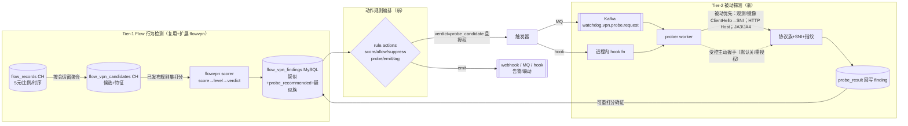

# Watchdog VPN/代理 Flow 检测与被动探测设计 (KISS-06 风险感知)

状态：设计冻结草案（2026-09-09）。本文只做**设计**，不含实现。落地按 §10 分阶段，每阶段守 8 门。

## 0. 目标

在 Flow 数据面之上，做**可配置**的 VPN/代理流量检测与**被动探测确证**，复用既有成果，忠实单域（无租户）。要覆盖的流量特征（用户需求逐条）：

- 源地址、目的地址等网络 **5 元**（src/dst IP、src/dst port、IP 协议）；
- **流量比例**（上下行对称度、方向主导度）；
- **协议**：常规 + 代理/隧道族 —— SOCKS、Trojan、Shadowsocks、SSR、通用 tunnel、OpenVPN/HTTP-SSL-VPN、私有隧道，含 **TLS/SNI**；
- **特征**（包大小分布、周期性、扇出等）；

并支持后续经 **MQ 或 hook** 触发**被动握手**或 **SNI/Host 头识别**，以及 VPN 特征配置与**动作规则编排**。

**范围优先级（用户 2026-09-09 定）**：**先做 Tier-1 流级别检测**（含源/目标**地址段 CIDR 直配**）；**7 层 / SNI / 协议族确证是后续「必要时」才做的、由被动触发的独立 agent 承担的工作**（见 §6/§10），不属本轮服务端核心。即：Tier-1 产出行为疑似 + 可选地经 MQ/hook 把 `probe_candidate` 抛给外部探测 agent；探测 agent 本身独立演进。

## 1. 决定架构的关键约束（grounding，已核查代码）

| 事实 | 出处 | 影响 |
|---|---|---|
| `flow_records` **无 L7/TLS/SNI/应用列**，仅 5 元 + `tcp_flags` + bytes/packets/timing/sampling | `deploy/migration/clickhouse/001_flow_schema.sql` | Flow 只能**行为推断**"疑似代理/VPN"；协议族与 SNI 的**确证必须来自 Tier-2 被动探测** |
| flowvpn 打分器注释「never authorizes or executes active probes」 | `internal/flowvpn/scorer.go:5` | Tier-1 只**建议**探测（`ProbeRecommended`），从不执行 |
| 全仓**无** prober / 握手 / SNI 抓取脚手架 | grep 全仓 | Tier-2 探测子系统**全新** |
| findings 已预留 `ProbeStatus/ProbeRecommended/ProbeBlockReason/ProbeJobID/ProbeResult` + `RuleKindProbe` + `VerdictProbeCandidate` | `internal/watchdog/flow_vpn_management.go`、`internal/flowvpn/{scorer,bundle}.go` | **二级模型已被数据模型预期**，Tier-2 是补齐而非重构 |
| Kafka 已在栈内（RawFlow 传输）；opjob 租约作业引擎已用于 address worker | `internal/server/config.go` KafkaConfig；`internal/opjob` | MQ 触发复用 Kafka；探测作业复用 opjob 租约 |

**诚实边界**：Flow 级检测本质是**统计/行为启发**，不是 DPI。"识别出 SOCKS/Trojan/SS/SSR/OpenVPN/SNI" 这类 L7 确证**只能**发生在 Tier-2。设计据此分层，避免把 flow 层吹成它做不到的事。

## 2. 二级架构



- **Tier-1**：flow_records → 会话窗聚合成候选（CH）→ 已发布规则集打分 → finding（MySQL），产出 `score/level/verdict/probe_recommended` + **疑似协议族**。大部分已存在，按 §5 扩展。
- **动作编排**：finding 经规则 `actions` 有序执行：`suppress`（终止）/`allow`/`score`（已有）+ **`probe`（触发 Tier-2）/`emit`（发事件）/`tag`（标注协议族）**（新）。
- **Tier-2**：`probe_candidate` 且规则含 `probe` 动作且通过授权门 → 经 **MQ 或 hook** 触发 prober → **被动优先**识别（观测/镜像下一个 TLS ClientHello 取 SNI、HTTP Host 头、JA3/JA4 指纹）→ 回写 `probe_result` → 可重打分确证。**受控主动握手指纹**为可选、默认关、需显式授权。

## 3. 可检测性分层（signal → 在哪层）

| Signal | Flow 可见? | 层 | 说明 |
|---|---|---|---|
| **源/目标地址段 (CIDR 直配)** | ✅ | T1 | **本轮新增** `LocalCIDRs/RemoteCIDRs`，裸网段 `Prefix.Contains(IP)` |
| 5 元：src/dst IP、src/dst port、ip_protocol | ✅ | T1 | 扩 `Match` 加 **Local 侧**端口/前缀（现仅 remote 侧） |
| 流量比例：对称度 / 方向主导度 | ✅ | T1 | 已有 `MinSymmetryRatio/MinDominanceRatio` |
| 时长/包数/活跃桶/字节量 | ✅ | T1 | 已有 `Min{DurationMS,FlowRecords,ActiveBuckets,TotalBytes}` |
| 包大小分布（分位）/周期性/扇出 | ✅ | T1（新特征） | 需扩候选物化（§5.1） |
| transport hint：tls/quic（端口启发） | 🟡 推断 | T1（弱） | 已有 `TransportHints`；仅端口/协议启发，非真 TLS |
| 协议族：SOCKS/Trojan/SS/SSR/OpenVPN/私有隧道 | ❌ 不可确证 | T1 疑似 + **T2 确证** | T1 用端口+比例+包大小给**疑似族**；T2 握手/指纹确证 |
| TLS **SNI** / HTTP **Host** / JA3/JA4 | ❌ 不可见 | **仅 T2** | 被动握手观测 / 受控主动握手 |

## 4. 配置模型（DDL 可配置，用户核心诉求）

分三类可配置对象。**KISS 原则**：签名规则复用并扩展既有 `flow_vpn_rules.match_json`（我已建 CRUD），动作与探测策略用独立小表，避免大宽表。

### 4.1 Signature（扩展 `flowvpn.Match`）

在 `internal/flowvpn/scorer.go` 的 `Match` 上**新增**（就地扩，无存量，旧 JSON 前向兼容——新字段 omitempty）。命名沿用候选的 **Local/Remote** 语义（`Candidate.LocalIP/RemoteIP`、`PrimaryLocalPort/PrimaryRemotePort`）：**Local = 源/内网侧，Remote = 目标/外部侧**。

- **地址段直配（CIDR，本轮用户新增）**：`LocalCIDRs []string`、`RemoteCIDRs []string` —— 直接 CIDR 段匹配（`netip.ParsePrefix` + `Prefix.Contains(candidate.{Local,Remote}IP)`），**区别于**地址库维度前缀 ID（`RemotePrefixIDs`）：CIDR 是运维手填的裸网段（如 `10.0.0.0/8`、某代理机房段），前缀 ID 是地址库发布的命名维度。二者可并用。IPv4/IPv6 各自匹配。
- **Local 侧 5 元补齐**：`LocalPorts []uint16`、`LocalPrefixIDs []string`（现仅 Remote 侧，补齐完整 5 元）；
- **行为特征阈值**：`MinPacketBytesP50/P95 *uint64`、`PeriodicityScoreMin *float64`、`RemoteFanoutMin/Max *uint32`（配合 §5.1 候选新列）；
- **疑似协议族启发**：`FamilyHints []ProtocolFamily`（端口+比例+包大小组合命中 → 打**疑似**标签，非确证）；
- **T2-only 匹配**（`tier:"probe"` 标注，Tier-1 打分器**跳过**，仅 Tier-2 探测 agent 结果匹配）：`SNIPatterns []string`（通配/正则受限）、`HostPatterns []string`、`JA3/JA4 []string`、`ProtocolFamilies []ProtocolFamily`（确证族）。**此组为 Tier-2 才评估**，Tier-1 忽略。

`ProtocolFamily` 枚举（新，`internal/flowvpn`）：`regular, socks5, trojan, shadowsocks, ssr, openvpn, http_ssl_vpn, generic_tunnel, private_tunnel, tls_unknown`。

### 4.2 Rule + **Actions（动作编排，新）**

复用既有 `flowvpn.Rule`（`Kind` passive/intelligence/probe、`Effect` score/allow/suppress、`Weight/Priority/Match`）。**新增有序动作**（在打分后阶段执行）：

```
actions: [
  { type: "tag",     family: "shadowsocks" },       // 标注疑似/确证族
  { type: "probe",   mode: "passive|active",         // 触发 Tier-2（active 需授权）
                     policy_ref: "<probe_policy_id>" },
  { type: "emit",    sink: "mq|webhook|hook",         // 发事件联动
                     target: "<topic|url|hook_name>" },
  { type: "suppress" }                                // 终止后续（复用 EffectSuppress 语义）
]
```

编排语义复用打分器既有 **terminal/priority** 排序：`suppress`/`allow` 为终止；`probe`/`emit`/`tag` 为副作用动作，打分完成、verdict 定档后按 priority 执行。

### 4.3 MySQL DDL 增量（设计，落地时定稿）

- `flow_vpn_rules`（**我已建 `0018`**）：加 `actions_json JSON`、`family_hint VARCHAR(32)`（就地 ALTER，无存量）；`match_json` 承载 §4.1 扩展字段（结构变，Go 侧解析）。
- **新** `flow_vpn_probe_policies`：`id, name, mode(passive/active), target_allow_json, target_deny_json, rate_per_min, max_concurrency, ttl_seconds, enabled, row_version, ...`（授权/限速/目标白名单——**主动探测的护栏**）。
- **探测结果**：复用 `flow_vpn_findings.probe_result_json` + `probe_status/probe_job_id`（已预留）；如需独立审计流水另加 `flow_vpn_probe_runs`（`id, finding_id, policy_id, mode, status, started_at, ended_at, result_json, error`）。
- RBAC：Tier-2 触发/查看用既有 `flow.probe`（catalog 已有）；探测策略管理用 `flow.vpn.manage`（我已加）；findings triage 用 `flow.vpn.triage`（findings 落地时补，见 §10-1）。

### 4.4 MQ / hook 触发（用户「mq或hook」→ 两者皆设计，可插拔）

- **hook**（单机自托管首选，KISS）：进程内注册的 `ProbeTrigger` 接口 `Trigger(ctx, ProbeRequest) error`。同步轻量或投递到 opjob 队列异步执行。无外部依赖。
- **MQ**（横向扩展/解耦）：发到 Kafka topic `watchdog.vpn.probe.request`，结果回 `watchdog.vpn.probe.result`。复用既有 KafkaConfig。prober 可独立进程消费。
- 二者经同一 `ProbeTrigger` 接口抽象，配置选路（`probe.trigger: hook|mq`）。`emit` 动作同理支持 webhook/MQ/hook 三 sink。

## 4.5 协议族启发目录（family-hint heuristics，✅ 机制已落地 2026-09-09）

**机制**（`internal/flowvpn/scorer.go`）：`ProtocolFamily` 枚举 + `Rule.FamilyHint`（可选，任意 effect 均可挂）+ `Result.FamilyHints`（命中 hint 规则的族集合，去重排序）。规则匹配即把其 `FamilyHint` 加入结果；打分/verdict 主干不变。族值：`regular / socks5 / shadowsocks / ssr / trojan / openvpn / http_ssl_vpn / generic_tunnel / private_tunnel / tls_unknown`。

**诚实前提**：flow 无 L7，族判定**只能是行为疑似、低置信**；`family_hint` 永非确证，靠 Tier-2 被动探测（SNI/握手）确证。启发规则是**可配置 seed（运维经 VPN rules CRUD 调端口/阈值）**，非硬编码。SS 与 SSR 在 flow 层**不可区分**（都→疑似，探测确证）；443/TLS 上 trojan / http_ssl_vpn / 正常 HTTPS 仅靠隧道行为（对称度/时长/持续）粗分。

**目录**（每行 = 一条 seed 规则：`Match` 命中 → 打 `FamilyHint`；端口为默认值，运维可改）：

| 族 | flow 行为签名（粗） | Match 要点 |
|---|---|---|
| socks5 | 默认 1080/TCP，通用隧道 | `remote_ports:[1080]`, `protocols:[6]` |
| shadowsocks | 高位非标端口/TCP，小而稳包，中对称，持续 | `protocols:[6]`, `max_packet_bytes_p50:~200`, `min_symmetry_ratio:~0.3`, `min_duration_ms` |
| ssr | 同 SS（flow 不可分），常特定端口 | 同 shadowsocks（+ 端口集） |
| trojan | 443/TLS 伪装 HTTPS，但隧道态：高对称 + 长时长 + 双向持续 | `remote_ports:[443]`, `transport_hints:[tls]`, `min_symmetry_ratio:~0.4`, `min_duration_ms(长)`, `min_total_bytes` |
| openvpn | UDP 1194 默认；或 TCP 443 变体 | `remote_ports:[1194]`,`protocols:[17]`（或 tcp/443 变体） |
| http_ssl_vpn | 443/TLS 上的 SSL-VPN（AnyConnect/OpenConnect 类），超长持续双向 | `remote_ports:[443]`,`transport_hints:[tls]`,`min_duration_ms(超长)`,`min_active_buckets` |
| generic_tunnel | 协议无关：高对称 + 长时长 + 持续 + 非 web 端口 | `min_symmetry_ratio(高)`,`min_duration_ms(长)`,`min_active_buckets` |
| private_tunnel | 自定义高位端口 + 隧道态 | 非标端口集 + 隧道阈值 |
| tls_unknown | 观测到 TLS 但无其他判别 | `transport_hints:[tls]` |

示例 seed 规则（trojan-疑似，可经 `POST /flow/vpn/rules` 下发）：
```json
{ "name": "suspect-trojan-tls443", "kind": "passive", "effect": "score", "weight": 20,
  "family_hint": "trojan",
  "match": { "remote_ports":[443], "transport_hints":["tls"],
             "min_symmetry_ratio":0.4, "min_duration_ms":600000, "min_total_bytes":10485760 } }
```
单测 `scorer_family_test.go`（收集/去重/校验）过。**VPN rules CRUD 已扩 `family_hint`**：`family_hint` 是 rule 级字段（非 Match 内），故需显式接线——`vpnRule`/`vpnRuleInput` 加字段、`normalizeVPNRule` 经 `flowvpn.NormalizeRule` 校验、select/scan/INSERT/UPDATE + schema `0018` 加 `family_hint VARCHAR(32)` 列（0018 本轮未提交，就地加列）。server build/VPN rules 单测过。

## 5. Tier-1 Flow 行为检测（复用 + 扩展）

### 5.1 候选物化扩展（`internal/flowch/vpn_candidate.go` + CH `003`）

现按会话窗聚合出 5 元 + 字节/记录/时长/geo/ASN/transport-hint。**新增列**（就地，无存量）：`source_prefix_id`、`packet_bytes_p50/p95`、`periodicity_score`、`remote_fanout`（该 local 对多少 remote）。聚合 SQL 相应扩展。

### 5.2 打分（复用 `flowvpn` scorer）

- `Match` 扩 source/特征/family-hint（§4.1）；`matchesCandidate` 加对应交集/阈值判断（`scorer.go:448` 一带）。
- 阈值 `Medium/High/Critical/Probe`（`CompiledRuleSet`，已有）不变；`ProbeThreshold` 命中 → `ProbeRecommended=true` + `VerdictProbeCandidate`。
- finding 新增 `candidate_family`（Tier-1 疑似族，来自 family-hint 命中）。

### 5.3 findings 物化写入方（**解 findings 推迟**，✅ 写入方+schema 已落地 2026-09-09）

原仓库**无 findings 写入方**故 schema 无法孤立臆造（见 `watchdog-kiss06-flow-detenant`）。现**写入方与 schema 一并落地**，契约自洽：
- **schema** `0019_flow_vpn_findings.sql`（去 tenant v2；扁平化 `ScoredCandidate`=Candidate+Result+MaterializationEvidence+generation + disposition/probe 工作流列 + `local_prefix_id/packet_bytes_p50/family_hints/symmetry/dominance` 新字段）。**`finding_key CHAR(64)` = sha256(window+conversation+dim/geo/class version) UNIQUE**，`id CHAR(26)` PK。
- **写入方** `flow_vpn_findings.go`：`materializeVPNFindings(ctx, []flowvpn.ScoredCandidate)` → 逐行 `INSERT … ON DUPLICATE KEY UPDATE`（按 finding_key）：**刷新 score/verdict/evidence/candidate 事实 + generation，但 disposition/note/by/at 与 probe_status/job/result 不在 UPDATE 集 → 人工 triage 与探测工作流跨重打分保留**；`row_version+1`。`evidence_json` = 匹配规则 evidence + 物化 evidence；`family_hints` JSON。
- **测试**：`flow_vpn_findings_test.go`（finding_key 确定性）+ env-gated 集成测试（物化→读→设 disposition→重打分刷新 score 但保留 disposition + row_version+1）。
- **读/disposition API ✅ 已落地**（`flow_vpn_findings_api.go`）：`GET /flow/vpn/findings`（list：`disposition/verdict/risk_level/probe_status/remote_country` 枚举过滤 + `from/to` 窗过滤 + `q` 搜 id/ip/prefix + sort/分页，门 `flow.vpn.view`）+ `GET /flow/vpn/findings/:id`（+ETag）+ `POST /flow/vpn/findings/:id/actions/disposition`（门 `flow.vpn.triage`；**If-Match 必需→缺 428、陈旧 412**；disposition 枚举校验 + note≤2000；unreviewed 清 by/at；audit）。DTO 扁平全字段（family_hints→[]、evidence→RawMessage、IP→字符串）。**新增 RBAC `flow.vpn.triage`**（analyst+operator）。测 `flow_vpn_findings_test.go`(disposition 校验) + env-gated API 集成(list/get/disposition/428/412)。
- **生产触发 ✅ 已落地**（`flow_vpn_detection.go`，config-gated 默认关）：`FlowVPNConfig`（enabled/window/interval/lag/max + 阈值，缺省自填）→ 后台 loop 每 tick 处理最近一个已关闭窗：`buildVPNRuleSet`（active 规则 + 配置阈值 + **version=活跃规则确定性哈希 `rs-<hex>`**）→ `VPNCandidateMaterializer.Run`（物化候选，generation=run 的 unix 秒，单调）→ `CandidateRunner.Run`（按 version 读最新 generation 候选 + 打分）→ `materializeVPNFindings`。幂等（generation 替换 + finding UPSERT），漏 tick 跳窗（cursor backfill 为后续）。`startVPNDetection` 在 `New()` 接线、`Close()` 取消；`s.clickHouse` 空则跳过。测 `flow_vpn_detection_test.go`（settings 缺省 + version 确定性）。**SQL/管线执行本体集成门控**（需真实 CH+flow 数据+active 规则）。

## 6. Tier-2 被动探测（全新，独立 agent，后续必要时）

**定位（用户定）**：Tier-2 是**被动触发的独立 agent** 的工作，非本轮服务端核心。服务端只负责：把 `probe_candidate` finding 经 MQ/hook **抛出**（§4.4 触发器 + §6.1 授权门），以及**接收回写**（§6.3）。探测 agent 如何实现（抓包/握手/指纹）独立演进、可用任意语言/部署，与服务端以 `watchdog.vpn.probe.{request,result}` 契约解耦。下文为该 agent 的参考设计，落地在 §10 靠后阶段、且仅「必要时」。

### 6.1 触发门（安全优先）

`probe_candidate` finding + rule 含 `probe` 动作 → 过门：①`flow.probe` 授权；②`probe_policy`（enabled、目标在 allowlist 且不在 denylist/私网保留、未超速率/并发）。被阻则 `probe_status=not_requested` + `probe_block_reason` 记原因（不静默）。

### 6.2 识别手段（**被动优先**）

- **被动握手观测**（默认、无侵入）：观测/镜像到该 remote 的**下一个** TLS ClientHello → 取 **SNI**；HTTP → **Host 头**；算 **JA3/JA4** 指纹。依赖 flow-adjacent 抓包（单机可选 pcap sidecar；无抓包能力时该手段降级不可用，记 `probe_block_reason`）。
- **受控主动握手指纹**（可选、**默认关**、需显式授权+policy）：对 `remote:port` 发起**一次**协议握手指纹（SOCKS5 方法协商 / TLS ClientHello 回显 / SS/SSR/Trojan/OpenVPN 特征探测），**只指纹不透传、不解密、不 MITM**。用于 flow 疑似但无被动样本时的确证。

### 6.3 回写与重打分

`probe_result_json`：`identified_family, sni, host, ja3, ja4, confidence, method`。`probe_status` 流转 `queued→running→completed|failed`。确证族/SNI 命中 §4.1 的 `tier:probe` 签名 → 触发一次**重打分**，可提升 `verdict/level`，并可再触发 `emit` 联动。

## 7. 复用矩阵

| 资产 | 复用 | 扩展 | 新建 |
|---|---|---|---|
| `flowvpn` scorer/Match/Rule/RuleKind/RuleEffect/thresholds/verdict | ✅ | Match 加 source/特征/family；actions | — |
| `flow_vpn_candidates` (CH) + materializer | ✅ | 加 source 5元 + 特征列 | — |
| VPN rules CRUD (`flow_vpn_rules.go`, 已建) | ✅ | actions_json/family_hint | — |
| VPN findings (Probe* 字段/verdict/disposition) | ✅ | candidate_family | 物化写入方（§5.3） |
| Kafka（MQ 传输）/ opjob（作业租约） | ✅ | — | probe topic / probe job type |
| address / geo / flowdimension（六维分类） | ✅ | — | — |
| Tier-2 | — | — | prober worker、probe_policy、protocol-family 分类、被动抓包接入、受控主动握手、hook 注册、emit sink |

## 8. 安全与合规（务必遵守）

- **主动探测是敏感/双用途能力**：默认关、需 `flow.probe` + policy 授权、目标 allowlist、速率/并发限制、私网/保留网段禁探、全量审计（`s.audit`）。
- **被动优先**：不透传、不解密、不 MITM；SNI/Host 仅存识别所需字段与指纹，遵守隐私规则（不入 URL/query，不跨源汇聚）。
- 只对**受监控网络自身 flow** 中出现的目的端点做识别，服务网络监控/风险感知的防御目的。

## 9. 主要假设（需用户确认，未阻塞设计）

1. **MQ 与 hook 都要**、可插拔选路（单机 hook、扩展 MQ）；`emit` 同样三 sink。若只需其一可裁剪。
2. **被动优先，主动握手默认关且需授权**（安全默认）。若你要主动为主，仍保留护栏但调默认。
3. 被动 SNI/Host **依赖 flow-adjacent 抓包**（pcap sidecar 或镜像口）；纯 NetFlow/sFlow 无载荷环境下被动 SNI 不可得，只能靠受控主动握手或行为疑似——此为物理约束，非设计取舍。
4. 协议族确证的**置信度**分级（behavioral-suspected / probe-confirmed），前端与告警据此区分"疑似"与"确证"。

## 10. 分阶段落地（每阶段独立可构建 + 8 门）

**本轮焦点 = Tier-1（阶段 1-2）**；Tier-2（阶段 3-4）是被动触发的**独立 agent**，「后续必要时」再做。

1. **【本轮首做】签名扩展 + Tier-1 补齐 + findings 物化**：
   - `flowvpn.Match` 扩 **地址段 + Local 5 元 + 包大小特征**（**✅ 已落地** 2026-09-09）；family-hint（待办）：
     - **地址段 CIDR 直配**：`Match.{LocalCIDRs,RemoteCIDRs}` + `canonicalCIDRs`（mask/dedup/sort，确定性发布字节）+ `matches()` 信号 `local_cidr`/`remote_cidr`（`Prefix.Contains`，OR，家族不匹配不中）。裸网段运维手填，区别于地址库前缀 ID。
     - **Local 侧 5 元**：`Match.{LocalPorts,LocalPrefixIDs}` + 信号 `local_port`/`local_prefix`。`LocalPorts` 匹配 `Candidate.PrimaryLocalPort`；`LocalPrefixIDs` 匹配 `Candidate.LocalPrefixID`（**✅ 物化 slice 已填充**）。
     - **包大小特征**：`Match.{MinPacketBytesP50,MaxPacketBytesP50}`（中位每包字节区间；Max=小包代理信号）+ `Candidate.PacketBytesP50` + 信号 `packet_bytes_p50`。**未知（0）时 min/max 均 fail-closed 不命中**（无数据不确证，避免误报）。**✅ 物化 slice 已填充**。
     - **✅ 物化 slice 已落地**（2026-09-09，flowvpn+flowch 全绿；SQL 执行本身集成门控）：CH 迁移 `013_flow_vpn_candidate_features.sql`（ALTER 加 `local_prefix_id LowCardinality(String)` + `packet_bytes_p50 UInt64 DEFAULT 0`）；materializer `vpn_candidate.go` 写入（`local_prefix_id` 入 argMax primary 元组第 7 位，`packet_bytes_p50 = toUInt64(round(quantileIf(0.5)(raw_bytes/raw_packets, raw_packets>0)))` 空则 0）；runner `vpnCandidateReadSQL` 读回投影 + `candidateColumns`/`results()`/`rowCount()`/scan 读入 Candidate；`schema_test`/`migrations_test`(12→13)/`runner_test` mock 同步更新。写→读→打分全链贯通。
     - 全部 omitempty → 旧规则 golden/bundle 字节不变（flowvpn 全绿）。VPN rules CRUD 自动承载（match_json，server 侧无改）。计数上限升 *10、空信号闸/canonicalMatch 校验（端口>0、prefix validIdentifier、packet min>0 且 min≤max）全覆盖。单测 `scorer_{cidr,local_features}_test.go`。
     - **本刀待办**：`family-hint`（协议族疑似标签，端口+比例+包大小组合，需先定族启发规则）。
   - **明确推迟（需重构/定义）**：`fan-out`（每 local 去重 remote 数——与候选「每会话」聚合粒度不同，须重构物化聚合）、`periodicity`（时序规律度——指标未定义 + 需 per-bucket 数据）。二者非本刀，避免加"永不命中"的投机信号。
   - 候选物化扩列（source 5元 + 包大小/周期/扇出，CH `003` 就地）；
   - **findings 物化写入方**（读候选 + 已发布规则集 → 写 `flow_vpn_findings`）+ findings 读/disposition API + `flow.vpn.triage`。→ **解 findings 推迟**（写入方与读方共定 schema）。
   - **✅ 本刀全部落地（2026-09-09）**：family-hint（机制+目录 §4.5+CRUD）、findings 物化写入方（§5.3）、findings 读/disposition API（§5.3）、生产触发 worker（§5.3）。**Tier-1 = flow 发现可疑 VPN flow + 明细，端到端贯通**。
2. **动作编排 = 推迟（待设计，用户 2026-09-09 定）**：`actions`（`emit`/`probe`/`tag`）经**异步 hook 函数或 MQ 队列**触发，是一项**重大改进，留作待设计项目**，非当前所需。目前只需 flow 能发现可疑 VPN flow 及其明细（阶段 1 已满足）。设计要点仍见 §4.2/§4.4，但不在近期编码范围。
3. **（后续必要时）Tier-2 触发契约**：`ProbeTrigger`（hook + Kafka `watchdog.vpn.probe.request`）+ `probe_policy` + `probe_result` 回写/重打分。服务端侧仅抛出+接收。
4. **（后续必要时）独立探测 agent**：被动 ClientHello/SNI/Host/JA3；受控主动握手指纹（授权、默认关）。独立部署，契约解耦。

## 11. 非目标

- 不做 DPI / 不解密 / 不 MITM / 不透传；不做全端口主动扫描；不在 flow 层假装 L7 确证；主动握手非默认、非无授权。

---
关联：`watchdog-kiss06-flow-design.md`（flow 单域化 + 查询收敛）、`watchdog-flow-module-design.md`（六维分类+地址库）、memory `watchdog-kiss06-flow-detenant`（VPN rules 已建 / findings 推迟原因）。
